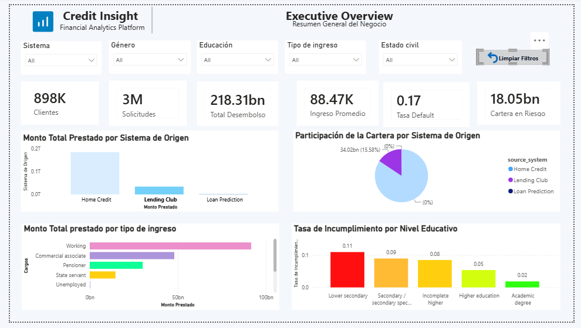

# Financial Risk Data Platform — Caso 5

## Descripción del Caso

Una entidad financiera digital especializada en préstamos y microcréditos en Latinoamérica enfrenta problemas críticos: aumento en incumplimientos de pago, crecimiento de cartera vencida, fraudes de identidad, créditos aprobados a clientes de alto riesgo, e inconsistencias entre plataformas financieras. Este proyecto construye una plataforma de datos que centraliza la información financiera, mejora la trazabilidad de créditos, detecta patrones de mora y riesgo, y consolida métricas confiables para la toma de decisiones.

**Fuente de datos principal:** [Home Credit Default Risk](https://www.kaggle.com/c/home-credit-default-risk) (Kaggle) — 7 tablas relacionadas con historial crediticio.

---

## Arquitectura Implementada

```text
Kaggle CSVs (Home Credit)
      │
      ▼
  BRONZE — Ingesta cruda (Parquet + metadata)
      │
      ▼
  SILVER — Limpieza, tipado, deduplicación
      │
      ▼
  INTERMEDIATE — Agregaciones de comportamiento financiero
      │   ├── agg_customer_installment_history
      │   ├── fct_customer_payment_behavior_features
      │   ├── agg_customer_bureau_history
      │   ├── agg_previous_application_history
      │   ├── agg_credit_card_behavior
      │   └── agg_pos_cash_behavior
      │
      ▼
  GOLD — Customer 360 (vista unificada por cliente)
      │
      ▼
  QUALITY — Reporte de calidad (HTML + JSON)
      │
      ▼
  SCORING — Modelo baseline (Logistic Regression / Random Forest)
      │
      ▼
  METRICS EXPORTER → PROMETHEUS → GRAFANA (4 dashboards)
      │
      ▼
  POWER BI — Dashboards de negocio (CSV export desde Gold)
```

---

## Repositorios

| Repo | Contenido |
|------|-----------|
| `financial-risk-cluster` | Infraestructura: PostgreSQL, RabbitMQ, Airflow, Spark, Nginx Proxy, Prometheus, Grafana, Metrics Exporter |
| `financial-analytics-keppler` | Pipeline de datos: DAGs, tareas, ML, calidad, métricas, reportes, tests |

---

## Rutas

### Local (desarrollo)

```text
/Users/juanmanuelnarvaez/Documents/Caso 5/financial-analytics-keppler/
├── data/seed/          ← CSVs descargados de Kaggle (NO se versionan)
├── data/bronze/        ← Salida Bronze
├── data/silver/        ← Salida Silver
├── data/intermediate/  ← Salida Intermediate
├── data/gold/          ← Salida Gold
├── pipelines/dags/     ← DAGs de Airflow
├── pipelines/tasks/    ← Tareas de cada capa
├── quality/            ← Reporte de calidad + metrics exporter
├── ml/training/        ← Modelo de scoring
├── ml/scoring/         ← Output de predicciones
├── reports/            ← Métricas, importancia de features, calidad
├── notebooks/eda/      ← EDA de cada dataset
├── tests/              ← Tests unitarios (pytest)
└── docs/final/         ← Documentación de sustentación
```

### Servidor (AWS)

```text
/opt/keppler/data-platform/                    ← Root del repo de desarrollo
/opt/keppler/data-platform/data/seed/          ← CSVs
/opt/keppler/data-platform/pipelines/dags/     ← Montado en Airflow como /opt/airflow/dags
/opt/keppler/data/database/keppler_metadata/   ← PostgreSQL data
/opt/keppler/data/rabbitmq/rabbitmq_data/      ← RabbitMQ data
/opt/keppler/data/proxy/data/                  ← Nginx Proxy data
```

---

## Variables de Entorno

### Airflow (master/.env y worker/.env)

```bash
# Obligatorias
AIRFLOW_UID=50000
EXTRA_REQUIREMENTS=pandas pyarrow boto3 requests scikit-learn python-dotenv prometheus-client

# Rutas (en servidor)
PYTHONPATH=/opt/keppler/data-platform

# Conexión a base de datos (Airflow metadata)
AIRFLOW__DATABASE__SQL_ALCHEMY=postgresql+psycopg2://USER:PASS@IP_DB:5432/DB_NAME

# Executor Celery + RabbitMQ
AIRFLOW__CELERY__BROKER_URL=amqp://USER:PASS@IP_RABBIT:5672/VHOST
AIRFLOW__CELERY__RESULT_BACKEND=rpc://USER:PASS@IP_RABBIT:5672/VHOST
```

### Worker (.env adicionales)

```bash
CELERY_HOSTNAME=worker-1
QUEUES=default
```

### PostgreSQL (db/.env)

```bash
POSTGRES_USER=
POSTGRES_PASSWORD=
POSTGRES_DB=
TZ=America/Bogota
```

### RabbitMQ (rabbitMQ/.env)

```bash
RABBITMQ_DEFAULT_USER=
RABBITMQ_DEFAULT_PASS=
RABBITMQ_DEFAULT_VHOST=
RABBITMQ_ERLANG_COOKIE=
```

### Monitoring (monitoring/.env)

```bash
PROMETHEUS_PORT=9090
GRAFANA_PORT=3000
METRICS_EXPORTER_PORT=8000
PIPELINE_DATA_DIR=/opt/keppler/data-platform
GRAFANA_ADMIN_USER=admin
GRAFANA_ADMIN_PASSWORD=admin
TZ=America/Bogota
```

---

## Pasos para Correr el Pipeline

### 1. Preparar datos de entrada

Descargar los CSVs de [Home Credit Default Risk](https://www.kaggle.com/c/home-credit-default-risk) y colocarlos en `data/seed/`:

```text
data/seed/
├── application_train.csv
├── bureau.csv
├── bureau_balance.csv
├── previous_application.csv
├── installments_payments.csv
├── credit_card_balance.csv
└── POS_CASH_balance.csv
```

### 2. Ejecutar pipeline local (sin Airflow)

```bash
cd /path/to/financial-analytics-keppler
python -m pipelines.tasks.bronze_tasks      # Ingesta Bronze
python -m pipelines.tasks.silver_tasks       # Limpieza Silver
python -m pipelines.tasks.intermediate_tasks # Agregaciones Intermediate
python -m pipelines.tasks.gold_tasks         # Customer 360 Gold
python -m quality.data_quality_report       # Reporte de calidad (HTML + JSON)
python -m ml.training.scoring_baseline      # Modelo ML (scoring + métricas)
python -m quality.metrics_exporter          # Iniciar exporter (puerto 8000)
```

### 3. Levantar infraestructura (servidor AWS)

```bash
# En cada directorio del repo financial-risk-cluster:
cd db && docker compose up -d
cd ../rabbitMQ && docker compose up -d
cd ../master && docker compose up -d
cd ../worker && docker compose up -d
cd ../spark && docker compose up -d
cd ../monitoring && bash prepare_exporter.sh /opt/keppler/data-platform && docker compose up -d --build
```

### 4. Ejecutar via Airflow

1. Acceder a `http://IP_SERVIDOR:8080` (o vía Nginx Proxy)
2. Buscar el DAG `case_5_financial_risk_pipeline`
3. Activar el DAG
4. Hacer trigger manual

### 5. Ver resultados

| Output | Ruta |
|--------|------|
| Datos Bronze | `data/bronze/<dataset>/` |
| Datos Silver | `data/silver/<dataset>/` |
| Agregaciones | `data/intermediate/<dataset>/` |
| Customer 360 | `data/gold/gold_customer_360/` |
| Reporte calidad HTML | `reports/data_quality_report.html` |
| Reporte calidad JSON | `reports/data_quality_summary.json` |
| Métricas del modelo | `reports/model_metrics.json` |
| Importancia de features | `reports/model_feature_importance.csv` |
| Scores por cliente | `ml/scoring/customer_risk_scores.parquet` |
| Export para Power BI | `reports/gold_customer_360_for_powerbi.csv` |
| Grafana (4 dashboards) | `http://IP_SERVIDOR:3000` (admin/admin) |
| Prometheus | `http://IP_SERVIDOR:9090` |
| Metrics Exporter | `http://IP_SERVIDOR:8000/metrics` |

---

## Grafana Dashboards

La plataforma incluye **4 dashboards de Grafana** que se provisionan automáticamente:

| Dashboard | UID | Contenido |
|-----------|-----|-----------|
| **Financial Risk Pipeline** | `financial-risk-caso5` | DAG Runs, tareas exitosas/fallidas, duración por tarea, estado de Airflow |
| **Data Quality** | `data-quality-caso5` | Score de calidad por capa/dataset, nulos, duplicados, tablas detalladas |
| **ML Model Metrics** | `model-metrics-caso5` | AUC/Accuracy/F1 por modelo, comparación LR vs RF, segmentación de riesgo (pie chart) |
| **Risk Segmentation** | `risk-segmentation-caso5` | Distribución LOW/MEDIUM/HIGH_RISK, gauge de riesgo alto, tendencia de calidad |

---

## Estructura de Carpetas

```text
financial-analytics-keppler/
├── data/
│   ├── seed/                    # CSVs de Kaggle (gitignored)
│   ├── bronze/                  # Datos crudos en Parquet
│   ├── silver/                  # Datos limpios y tipados
│   ├── intermediate/            # Agregaciones de comportamiento
│   └── gold/                    # Customer 360 final
├── pipelines/
│   ├── dags/
│   │   └── case_5_financial_risk_pipeline.py  # DAG principal end-to-end
│   ├── tasks/
│   │   ├── bronze_tasks.py      # Ingesta de CSVs a Parquet
│   │   ├── silver_tasks.py      # Limpieza y estandarización
│   │   ├── intermediate_tasks.py # Agregaciones de riesgo
│   │   └── gold_tasks.py        # Construcción de Customer 360
│   └── common/                  # Utilidades compartidas
├── quality/
│   ├── data_quality_report.py   # Generador de reportes HTML/JSON
│   └── metrics_exporter.py      # Exporter de métricas para Prometheus/Grafana
├── ml/
│   ├── training/
│   │   └── scoring_baseline.py  # Modelo baseline de riesgo crediticio
│   └── scoring/
│       └── customer_risk_scores.parquet  # Output del modelo
├── models/gold/                 # Modelos dbt (futuro)
├── reports/                     # Métricas, calidad, exports
├── notebooks/eda/               # 7 notebooks EDA de Home Credit
├── docs/
│   ├── final/                   # Documentación de sustentación (8 docs)
│   └── architecture/            # Documentos de arquitectura
├── tests/
│   └── test_pipeline_tasks.py   # 31 tests unitarios
└── pyproject.toml               # Dependencias del proyecto
```




---

## Evidencias Generadas

| Evidencia | Formato | Descripción |
|-----------|---------|-------------|
| `reports/data_quality_report.html` | HTML | Reporte visual de calidad por capa y dataset |
| `reports/data_quality_summary.json` | JSON | Métricas de calidad consumibles por código y Grafana |
| `reports/model_metrics.json` | JSON | AUC, Accuracy, F1, Precision, Recall, Confusion Matrix |
| `reports/model_feature_importance.csv` | CSV | Ranking de features más importantes del modelo |
| `reports/gold_customer_360_for_powerbi.csv` | CSV | Datos listos para conectar a Power BI |
| `ml/scoring/customer_risk_scores.parquet` | Parquet | Scores de riesgo por cliente |
| Grafana: Pipeline | Web | Monitoreo en tiempo real del pipeline Airflow |
| Grafana: Data Quality | Web | Dashboards de calidad de datos por capa |
| Grafana: ML Metrics | Web | Métricas del modelo y comparación LR vs RF |
| Grafana: Risk Segmentation | Web | Segmentación de riesgo con gráficos de torta y gauge |
| Notebooks EDA | Jupyter | Análisis exploratorio de los 7 datasets |
| Tests | pytest | 31 tests unitarios cubriendo todas las capas |

---

## Documentación de Sustentación

La carpeta `docs/final/` contiene 8 documentos de soporte:

| Documento | Contenido |
|-----------|-----------|
| `architecture.md` | Arquitectura completa, decisiones técnicas, patrones de diseño |
| `implementation_summary.md` | Resumen de implementación, componentes, progreso |
| `data_quality.md` | Estrategia de calidad de datos, métricas, reglas por capa |
| `modeling.md` | Documentación del modelo ML, features, métricas, resultados |
| `demo_script.md` | Script de demostración paso a paso para sustentación |
| `lineage.md` | Linaje de datos source-to-target con diagrama Mermaid |
| `data_dictionary.md` | Diccionario de datos completo (Bronze, Silver, Intermediate, Gold) |
| `business_rules.md` | Reglas de negocio codificadas (DQ, FE, ML) con IDs de auditoría |

---

## Tests

```bash
cd /path/to/financial-analytics-keppler
pip install -e ".[dev]"
pytest tests/ -v
```

**31 tests** cubriendo:
- Bronze: ingesta, metadata columns, edge cases
- Silver: deduplicación, DAYS_EMPLOYED anomaly, null handling
- Gold: JOIN, columnas computadas, segmentación de riesgo
- Quality: scoring perfecto, nulos, duplicados, profiling
- ML: preparación de features, importancia, modelos

---

## Limitaciones Conocidas

1. **Python puro vs Spark:** Las transformaciones usan Pandas en lugar de Spark. Para volúmenes de producción (100M+ filas) se debería migrar a PySpark o SparkSubmitOperator.
2. **Modelo baseline:** El scoring usa Logistic Regression y Random Forest sin optimización de hiperparámetros. Es un punto de partida, no un modelo de producción.
3. **Sin dbt:** La capa Gold se construye con Pandas en lugar de dbt. Los modelos dbt están diseñados (ver rama `SCRUM-85`) pero no integrados.
4. **Sin Athena/Glue:** El catálogo de datos y las consultas ad-hoc (SCRM-89) no están integrados.
5. **Spark en modo local:** El clúster Spark está configurado en modo standalone dentro de una sola EC2, no distribuido entre instancias.
6. **Datos estáticos:** La ingesta es manual (CSVs descargados). No hay ingesta continua ni conectores a APIs externas funcionando.
7. **Metrics Exporter requiere pipeline ejecutado:** Los dashboards de calidad y modelo solo muestran datos después de que el pipeline ha corrido al menos una vez.

---

## Futuras Mejoras

- [ ] Migrar transformaciones a PySpark con SparkSubmitOperator
- [ ] Integrar dbt para transformaciones SQL en Silver y Gold
- [ ] Implementar schema registry (SCRUM-62)
- [ ] Configurar Athena + Glue Catalog para consultas ad-hoc (SCRM-89)
- [ ] Agregar exporters de PostgreSQL y RabbitMQ a Prometheus
- [ ] Implementar Great Expectations como validación en cada capa
- [ ] Optuna o GridSearch para optimización de hiperparámetros del modelo
- [ ] Feature Store con Feast o similar
- [ ] Ingesta automatizada desde APIs externas
- [ ] CI/CD con tests automáticos por capa
- [ ] Power BI dashboard template con las métricas de riesgo
- [ ] Alertas en Grafana (quality score < 70, AUC < 0.6, HIGH_RISK > 40%)

---

<<<<<<< HEAD
# Ingestion

See `ingestion/README.md` for the local dataset ingestion flow and the S3 upload
commands.

---

# Project Goal
=======
## Stack Tecnológico
>>>>>>> Changes-code

| Componente | Tecnología |
|------------|------------|
| Orquestación | Apache Airflow 3.2 |
| Procesamiento | Python (Pandas), Apache Spark 3.5 |
| Formato | Parquet (Snappy) |
| Base de datos | PostgreSQL 15 |
| Mensajería | RabbitMQ 3.13 (Celery) |
| ML | Scikit-Learn |
| Monitoreo | Prometheus + custom Metrics Exporter |
| Visualización | Grafana (4 dashboards) + Power BI (CSV export) |
| Infraestructura | Docker Compose en AWS EC2 |
