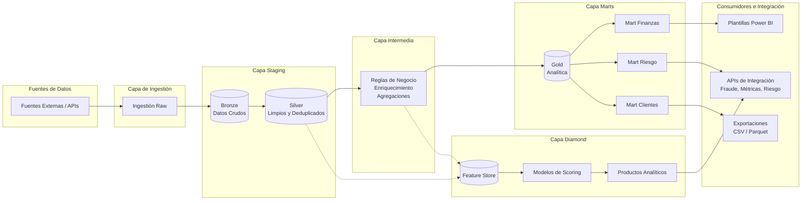
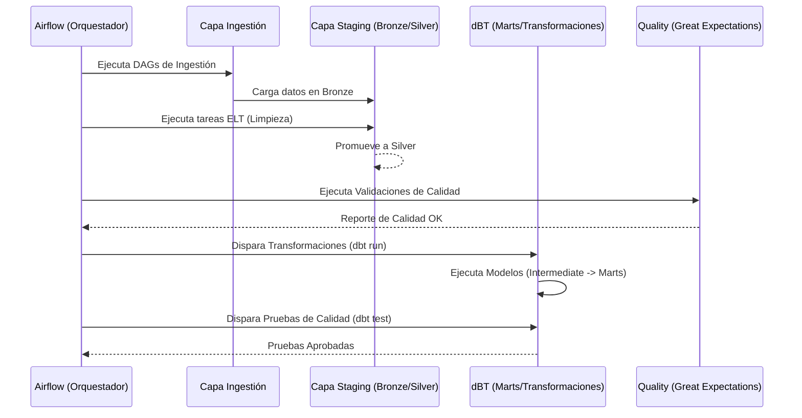

# Architecture Flows & Technologies Summary

Este documento resume la arquitectura de datos implementada en la plataforma, destacando los flujos de información a través de las diferentes capas y las tecnologías principales utilizadas, basándose en la refactorización hacia una arquitectura orientada a lógica de negocio (Medallion Architecture).

## Diagrama de Flujo de Datos Arquitectónico

A continuación se presenta el flujo de datos principal a través de las capas de la plataforma:

## Flujo de Trabajo y Capas (Capas Arquitectónicas)

1. **Ingestion Layer (`ingestion/`)**: Recibe los datos crudos desde los sistemas origen.
2. **Staging Layer (`staging/`)**:
   - **Bronze**: Almacenamiento de datos crudos tal cual se reciben.
   - **Silver**: Limpieza, estandarización y deduplicación inicial de los datos.
3. **Intermediate Layer (`intermediate/`)**: Aplicación de lógica y reglas de negocio, cálculos y enriquecimiento de datos previos a su estructuración analítica.
4. **Marts Layer (`marts/`)**: Modelado dimensional de los datos estructurado en *Data Marts* temáticos (Finanzas, Riesgo, Clientes) y capa de oro (Gold). Toda la transformación en esta etapa está impulsada por modelos dBT.
5. **Diamond Layer (`diamond/`)**: Capa de convergencia avanzada donde se gestionan los *Feature Stores* para Machine Learning, modelos de *Scoring*, y productos analíticos listos para consumo en aplicaciones.
6. **ML Layer (`ml/`)**: Entrenamiento, evaluación e inferencia de modelos de Machine Learning utilizando *datasets* de la plataforma.
7. **Quality & Governance (`quality/`, `governance/`)**: Operan de forma transversal perfilando, validando (Great Expectations) y catalogando los datos en todo el ciclo de vida, asegurando el cumplimiento de contratos y linaje.

## Flujo de Orquestación y Transformación

## Tecnologías y Herramientas Planteadas

Basado en la estructura y configuración extraída de los reportes, la plataforma se apoya en el siguiente *Stack Tecnológico*:

### 1. Orquestación y Flujo de Trabajo
- **Apache Airflow**: Motor principal de orquestación (DAGs de producción: `bronze_pipeline_dag`, `elt_pipeline_dag`, `etl_pipeline_dag`, `monitoring_dag`).

### 2. Transformación y Modelado
- **dBT (Data Build Tool)**: Estandarización del modelado de datos mediante SQL, macros, snapshots para dimensiones SCD Tipo 2, y tests de datos nativos.

### 3. Almacenamiento y Formatos
- **AWS S3**: Almacenamiento en la nube u Object Storage (evidenciado por `s3_client.py`).
- **PostgreSQL**: Base de datos relacional para analítica o almacenamiento de estados (`integration/postgresql/`, `db_client.py`).
- **Apache Parquet**: Formato columnar principal para almacenamiento eficiente y exportación de datos (`parquet_utils.py`, `integration/exports/parquet/`).

### 4. Calidad y Gobernanza
- **Great Expectations**: Framework principal para aserciones y monitoreo de calidad de datos (`quality/expectations/`).
- **Validaciones custom**: Scripts de Python nativos (`schema_utils.py`, perfiles y aserciones de gobernanza).

### 5. Integración y Consumo (BI / APIs)
- **Power BI**: Para análisis de BI y Dashboards (`integration/powerbi/`).
- **APIs de Integración**: Interfaces para consumo programático, específicamente APIs de Fraude, Métricas y Riesgo.
- **Machine Learning (Python)**: Infraestructura pura para entrenamiento, inferencia y *Feature Store* de modelos.
