# Propuesta de Infraestructura — Data Platform Keppler
## CASO 5: Descontrol Operacional y Riesgo Crediticio

> **Versión:** 1.0 · **Fecha:** Junio 2026 · **Entorno:** AWS Free Tier  
> **Alcance:** Ingestión desde Kaggle → Bronze → Silver → Gold → Diamond

---

## Índice

1. [Resumen Ejecutivo](#1-resumen-ejecutivo)
2. [Cluster Existente y Estrategia de Reutilización](#2-cluster-existente-y-estrategia-de-reutilización)
3. [Arquitectura de Red y VPC](#3-arquitectura-de-red-y-vpc)
4. [Flujo General End-to-End](#4-flujo-general-end-to-end)
5. [Fase 1 — Extracción y Carga Bronze (Python + Airflow)](#5-fase-1--extracción-y-carga-bronze-python--airflow)
6. [Fase 2 — ETL Distribuido Bronze → Silver (Spark)](#6-fase-2--etl-distribuido-bronze--silver-spark)
7. [Fase 3 — ELT Silver → Gold (dbt + Athena + Glue)](#7-fase-3--elt-silver--gold-dbt--athena--glue)
8. [Fase 4 — Capas Analíticas y ML (Diamond)](#8-fase-4--capas-analíticas-y-ml-diamond)
9. [Modelo Dimensional — Star Schema Financiero](#9-modelo-dimensional--star-schema-financiero)
10. [Stack Tecnológico por Capa](#10-stack-tecnológico-por-capa)
11. [Estructura S3 — Data Lake](#11-estructura-s3--data-lake)
12. [Configuración Spark en Free Tier](#12-configuración-spark-en-free-tier)
13. [Cronograma de 2 Semanas](#13-cronograma-de-2-semanas)

---

## 1. Resumen Ejecutivo

La plataforma resolverá los problemas de **descontrol operacional y riesgo crediticio** de la entidad financiera mediante una arquitectura **Medallion híbrida** (ETL + ELT), distribuida sobre un cluster AWS Free Tier existente con máximo 4 GB RAM por instancia.

### Decisiones Clave de Diseño

| Decisión | Elección | Razón |
|----------|----------|-------|
| Ingestión de datos | Python puro en workers Airflow | Aprovecha cluster existente, sin costos adicionales |
| Procesamiento masivo | Spark Standalone en cluster EC2 | Las mismas instancias Airflow + RabbitMQ + Postgres actúan como Spark workers |
| Formato intermedio | **Apache Iceberg sobre S3** | ACID, time travel, upserts nativos, perfecto para deduplicación |
| Transformaciones analíticas | dbt + Athena + Glue Catalog | ELT sin servidor, pago por query, ideal para Free Tier |
| Orquestación | Airflow con Celery + RabbitMQ | Ya instalado en el cluster |
| Warehouse | PostgreSQL RDS (instancia existente) | Para metadatos Airflow + tablas Gold pequeñas |

---

## 2. Cluster Existente y Estrategia de Reutilización

### 2.1 Inventario del Cluster Actual

```
┌────────────────────────────────────────────────────────────────────┐
│                        VPC PRIVADA AWS                              │
│                                                                      │
│  ┌──────────────────────┐    ┌──────────────────────────────────┐  │
│  │  EC2 — MASTER        │    │  EC2 — WORKER 1                  │  │
│  │  Airflow Scheduler   │    │  Airflow Celery Worker           │  │
│  │  Airflow Webserver   │    │  Max 4 GB RAM                    │  │
│  │  Max 4 GB RAM        │    └──────────────────────────────────┘  │
│  └──────────────────────┘                                           │
│                              ┌──────────────────────────────────┐  │
│  ┌──────────────────────┐    │  EC2 — WORKER 2                  │  │
│  │  EC2 — RABBITMQ      │    │  Airflow Celery Worker           │  │
│  │  Message Broker      │    │  Max 4 GB RAM                    │  │
│  │  Celery Backend      │    └──────────────────────────────────┘  │
│  │  Max 4 GB RAM        │                                           │
│  └──────────────────────┘    ┌──────────────────────────────────┐  │
│                              │  EC2 — WORKER 3                  │  │
│  ┌──────────────────────┐    │  Airflow Celery Worker           │  │
│  │  EC2 — POSTGRES      │    │  Max 4 GB RAM                    │  │
│  │  Metadata Airflow    │    └──────────────────────────────────┘  │
│  │  Max 4 GB RAM        │                                           │
│  └──────────────────────┘                                           │
│                                                                      │
└────────────────────────────────────────────────────────────────────┘

     ┌──────────────────────┐
     │  EC2 — PROXY         │  ← Subnet Pública
     │  Nginx Proxy Manager │
     │  Acceso externo UI   │
     └──────────────────────┘
```

### 2.2 Estrategia de Doble Rol: Airflow + Spark

La clave de esta arquitectura es que **las mismas instancias sirven dos propósitos** en distintos momentos del pipeline:

```
┌─────────────────────────────────────────────────────────────────────┐
│                     MODO: INGESTIÓN (Python)                         │
│                      Horario: continuo                               │
│                                                                      │
│   Master EC2           Worker 1          Worker 2         Worker 3  │
│  ┌──────────┐         ┌──────────┐      ┌──────────┐    ┌────────┐ │
│  │ Airflow  │─tasks──▶│ Python   │      │ Python   │    │ Python │ │
│  │ Scheduler│         │ Kaggle   │      │ Kaggle   │    │ Kaggle │ │
│  │          │         │ → S3     │      │ → S3     │    │ → S3   │ │
│  └──────────┘         └──────────┘      └──────────┘    └────────┘ │
└─────────────────────────────────────────────────────────────────────┘

┌─────────────────────────────────────────────────────────────────────┐
│                   MODO: ETL SPARK (Distribuido)                      │
│                    Horario: ventana nocturna                         │
│                                                                      │
│   Master EC2           Worker 1          Worker 2         Worker 3  │
│  ┌──────────┐         ┌──────────┐      ┌──────────┐    ┌────────┐ │
│  │  Spark   │◀───────▶│  Spark   │      │  Spark   │    │ Spark  │ │
│  │  Master  │         │  Worker  │      │  Worker  │    │ Worker │ │
│  │  Driver  │         │  1.5g RAM│      │  1.5g RAM│    │ 1.5g   │ │
│  └──────────┘         └──────────┘      └──────────┘    └────────┘ │
│                                                                      │
│   RabbitMQ EC2              Postgres EC2                            │
│  ┌──────────────┐          ┌───────────────┐                       │
│  │ Spark Worker │          │ Spark Worker  │  ← Se suman al ETL   │
│  │ Adhoc 1.5g   │          │ Adhoc 1.5g    │    cuando no hay      │
│  └──────────────┘          └───────────────┘    carga en Airflow   │
└─────────────────────────────────────────────────────────────────────┘
```

### 2.3 Plan de Reconfiguración del Cluster

| Instancia | Rol Primario | Rol Secundario (ETL Spark) | Memoria Spark |
|-----------|-------------|---------------------------|---------------|
| EC2 Master | Airflow Scheduler + Spark Master | Spark Driver | 1.0 GB driver |
| EC2 Worker 1 | Airflow Celery + Spark Worker | Spark Executor | 1.5 GB exec |
| EC2 Worker 2 | Airflow Celery + Spark Worker | Spark Executor | 1.5 GB exec |
| EC2 Worker 3 | Airflow Celery + Spark Worker | Spark Executor | 1.5 GB exec |
| EC2 RabbitMQ | Celery Broker (siempre activo) + Spark Worker | Spark Executor adhoc | 1.5 GB exec |
| EC2 Postgres | Metadata DB (siempre activo) + Spark Worker | Spark Executor adhoc | 1.0 GB exec |

> **Resultado:** Spark cluster con 1 Master + hasta 5 Workers = ~7.5 GB RAM distribuida para ETL

---

## 3. Arquitectura de Red y VPC

```
┌──────────────────────────────────────────────────────────────────────────────┐
│                              AWS REGION                                       │
│                                                                               │
│  ┌─────────────────┐                                                          │
│  │  SUBNET PÚBLICA │                                                          │
│  │                 │    Internet Gateway                                       │
│  │  ┌───────────┐  │◀─────────────────── Users / Devs                        │
│  │  │ EC2 PROXY │  │                                                          │
│  │  │  Nginx PM │  │                                                          │
│  │  │  :80/:443 │  │                                                          │
│  │  └─────┬─────┘  │                                                          │
│  └────────┼────────┘                                                          │
│           │ (proxy_pass)                                                      │
│  ┌────────▼──────────────────────────────────────────────────────────────┐   │
│  │                         SUBNET PRIVADA                                 │   │
│  │                                                                        │   │
│  │  ┌────────────┐  ┌────────────┐  ┌────────────┐  ┌──────────────┐    │   │
│  │  │EC2 MASTER  │  │EC2 WORKER1 │  │EC2 WORKER2 │  │ EC2 WORKER3  │    │   │
│  │  │:8080 AF UI │  │Celery/Spark│  │Celery/Spark│  │ Celery/Spark │    │   │
│  │  │:7077 Spark │  │            │  │            │  │              │    │   │
│  │  │:4040 Spark │  │            │  │            │  │              │    │   │
│  │  └────────────┘  └────────────┘  └────────────┘  └──────────────┘    │   │
│  │                                                                        │   │
│  │  ┌────────────┐  ┌──────────────┐                                     │   │
│  │  │EC2 RABBITMQ│  │ EC2 POSTGRES │                                     │   │
│  │  │:5672 AMQP  │  │ :5432 DB     │                                     │   │
│  │  │:15672 UI   │  │ Airflow Meta │                                     │   │
│  │  └────────────┘  └──────────────┘                                     │   │
│  │                                                                        │   │
│  │  Security Groups:                                                      │   │
│  │  • sg-airflow: :8080, :8793, :7077, :4040-4045                       │   │
│  │  • sg-spark:   :7077, :7078, :8080 (Spark UI)                        │   │
│  │  • sg-internal: All traffic within subnet                             │   │
│  └────────────────────────────────────────────────────────────────────────┘   │
│                                                                               │
│  ┌───────────────────────────────────────────────────────────────────────┐   │
│  │                        AWS MANAGED SERVICES                            │   │
│  │                                                                        │   │
│  │   S3 Buckets             Athena            Glue Catalog               │   │
│  │  ┌───────────┐         ┌────────┐         ┌──────────┐               │   │
│  │  │keppler-   │         │Ad-hoc  │         │ Data     │               │   │
│  │  │data-lake  │◀───────▶│SQL     │◀───────▶│ Catalog  │               │   │
│  │  │/bronze    │         │Queries │         │ Tables   │               │   │
│  │  │/silver    │         └────────┘         └──────────┘               │   │
│  │  │/gold      │                                                        │   │
│  │  │/artifacts │         IAM · CloudWatch · CloudTrail                  │   │
│  │  └───────────┘                                                        │   │
│  └───────────────────────────────────────────────────────────────────────┘   │
└──────────────────────────────────────────────────────────────────────────────┘
```

---

## 4. Flujo General End-to-End

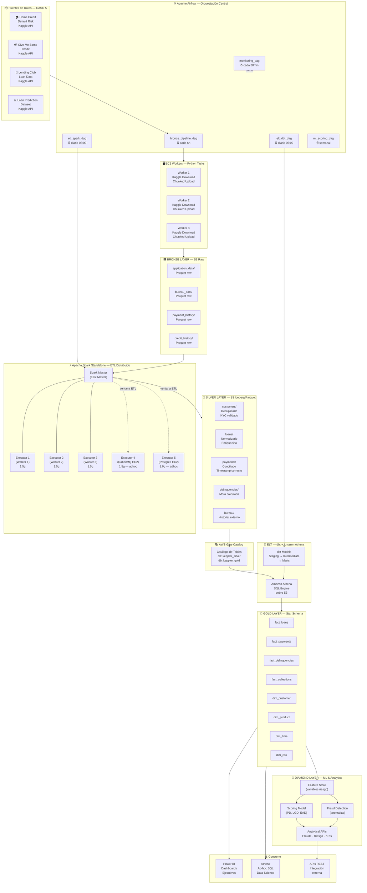

---

## 5. Fase 1 — Extracción y Carga Bronze (Python + Airflow)

### 5.1 Diagrama de Secuencia — Ingestión Kaggle → S3

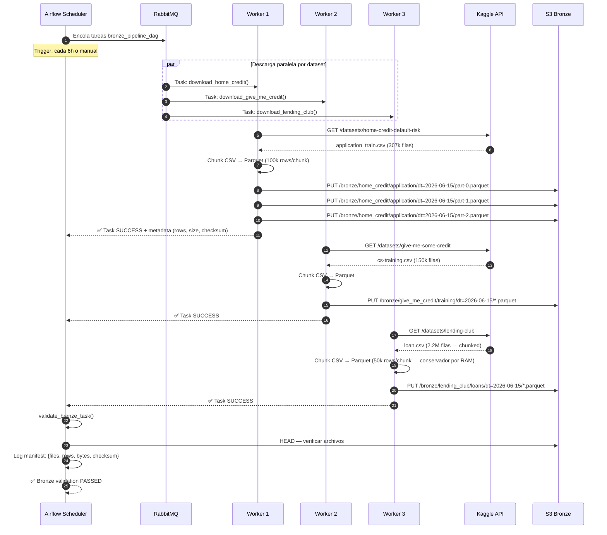

### 5.2 Código de Referencia — Task de Ingestión

```python
# airflow/tasks/bronze/ingest_kaggle.py

def download_and_upload_to_bronze(dataset_name: str, table_name: str,
                                   chunk_size: int = 50_000, **kwargs):
    """
    Task Airflow: descarga dataset Kaggle en chunks y sube a S3 Bronze.
    Diseñado para workers con máx 4 GB RAM.
    """
    import pandas as pd
    import pyarrow as pa
    import pyarrow.parquet as pq
    import boto3
    from kaggle.api.kaggle_api_extended import KaggleApi

    api = KaggleApi()
    api.authenticate()

    s3 = boto3.client('s3')
    bucket = 'keppler-data-lake'
    dt = kwargs['ds']  # 2026-06-15

    # Stream CSV → Parquet chunks → S3
    local_path = f'/tmp/{table_name}.csv'
    api.dataset_download_file(dataset_name, table_name, path='/tmp', unzip=True)

    schema = None
    part = 0
    for chunk in pd.read_csv(local_path, chunksize=chunk_size, low_memory=False):
        table = pa.Table.from_pandas(chunk)
        if schema is None:
            schema = table.schema

        buf = pa.BufferOutputStream()
        pq.write_table(table, buf, compression='snappy')

        s3_key = f'bronze/{dataset_name}/{table_name}/dt={dt}/part-{part:04d}.parquet'
        s3.put_object(
            Bucket=bucket,
            Key=s3_key,
            Body=buf.getvalue().to_pybytes(),
            Metadata={'source': 'kaggle', 'rows': str(len(chunk)), 'chunk': str(part)}
        )
        part += 1

    return {'status': 'ok', 'parts': part, 'dataset': dataset_name, 'table': table_name}
```

### 5.3 DAG de Bronze

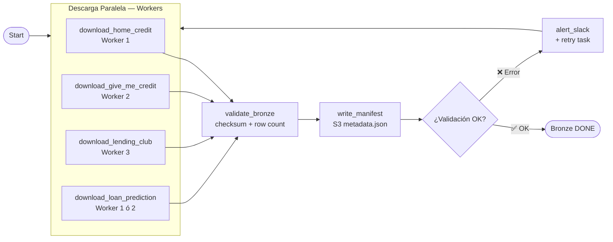

---

## 6. Fase 2 — ETL Distribuido Bronze → Silver (Spark)

### 6.1 Topología del Cluster Spark Standalone

```
┌──────────────────────────────────────────────────────────────────┐
│                   SPARK STANDALONE CLUSTER                        │
│                                                                   │
│  ┌────────────────────────────────────────────────────────────┐  │
│  │  EC2 MASTER — Spark Master + Driver                        │  │
│  │  spark://master:7077                                       │  │
│  │  Spark UI: :8080  |  Driver UI: :4040                      │  │
│  │  Memoria Driver: 1.0g  |  Cores: 1                         │  │
│  └────────────────┬───────────────────────────────────────────┘  │
│                   │                                               │
│       ┌───────────┼───────────┬──────────────┐                   │
│       ▼           ▼           ▼              ▼                   │
│  ┌─────────┐ ┌─────────┐ ┌─────────┐ ┌─────────┐               │
│  │Worker 1 │ │Worker 2 │ │Worker 3 │ │RabbitMQ │               │
│  │Executor │ │Executor │ │Executor │ │Executor │               │
│  │1.5g RAM │ │1.5g RAM │ │1.5g RAM │ │1.5g RAM │               │
│  │2 cores  │ │2 cores  │ │2 cores  │ │1 core   │               │
│  └─────────┘ └─────────┘ └─────────┘ └─────────┘               │
│                                        ┌─────────┐               │
│                                        │Postgres │               │
│                                        │Executor │               │
│                                        │1.0g RAM │               │
│                                        │1 core   │               │
│                                        └─────────┘               │
│                                                                   │
│  Total disponible: ~7.5 GB RAM  |  ~9 cores                     │
│  Particiones recomendadas: 18-24 (2-3x cores)                    │
└──────────────────────────────────────────────────────────────────┘
```

### 6.2 Diagrama de Secuencia — ETL Spark Bronze → Silver

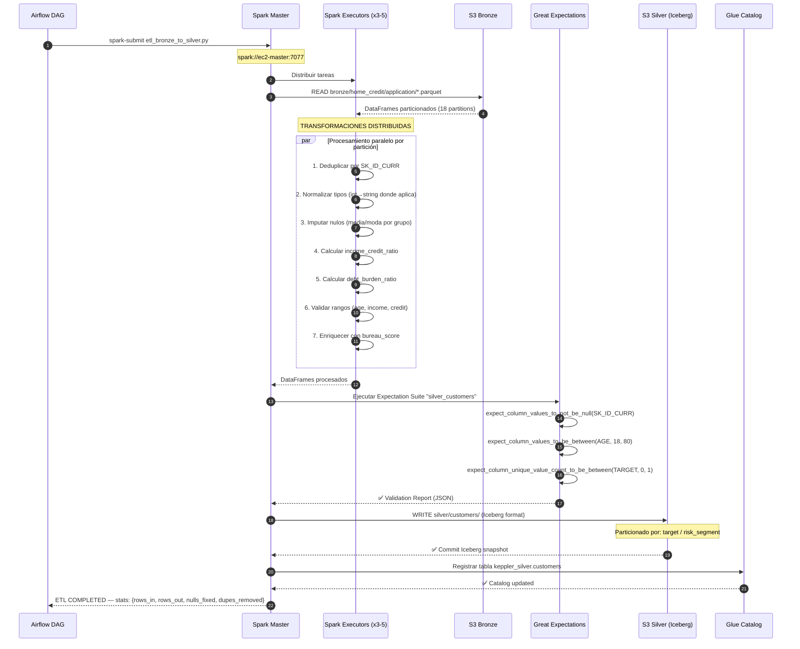

### 6.3 Pipeline de Transformaciones por Tabla

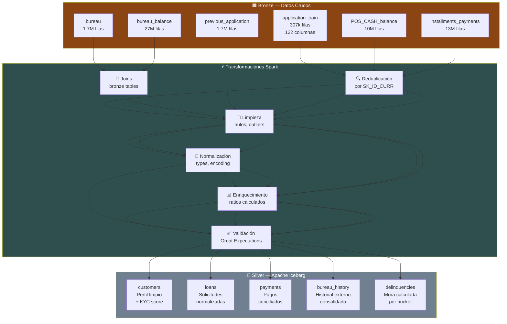

---

## 7. Fase 3 — ELT Silver → Gold (dbt + Athena + Glue)

### 7.1 Arquitectura ELT Sin Servidor

```
┌─────────────────────────────────────────────────────────────────────────┐
│                         ELT PIPELINE                                     │
│                                                                          │
│  ┌──────────────┐         ┌────────────────────────────────────────┐   │
│  │  dbt Core    │         │         Amazon Athena                   │   │
│  │  (EC2 Master │────────▶│  Motor SQL sobre S3                    │   │
│  │  o Worker)   │ queries │  Presto Engine                         │   │
│  │              │◀────────│  Pago por TB escaneado                  │   │
│  └──────────────┘ results │  ~$5/TB — muy barato para Free Tier    │   │
│                           └────────────────┬───────────────────────┘   │
│                                            │ lee/escribe                │
│                           ┌────────────────▼───────────────────────┐   │
│                           │         S3 Data Lake                    │   │
│                           │  /silver/  (Iceberg — lee dbt)         │   │
│                           │  /gold/    (Parquet — escribe dbt)      │   │
│                           └────────────────────────────────────────┘   │
│                                            │                            │
│                           ┌────────────────▼───────────────────────┐   │
│                           │        AWS Glue Catalog                 │   │
│                           │  keppler_silver.customers               │   │
│                           │  keppler_silver.loans                   │   │
│                           │  keppler_gold.fact_loans                │   │
│                           │  keppler_gold.dim_customer              │   │
│                           └────────────────────────────────────────┘   │
└─────────────────────────────────────────────────────────────────────────┘
```

### 7.2 Flujo de Modelos dbt

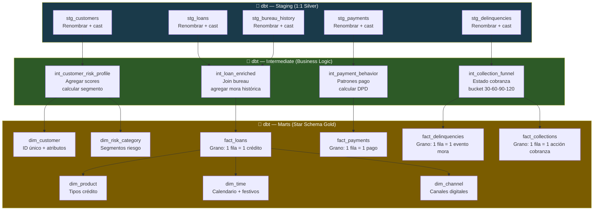

### 7.3 Secuencia dbt + Athena + Glue

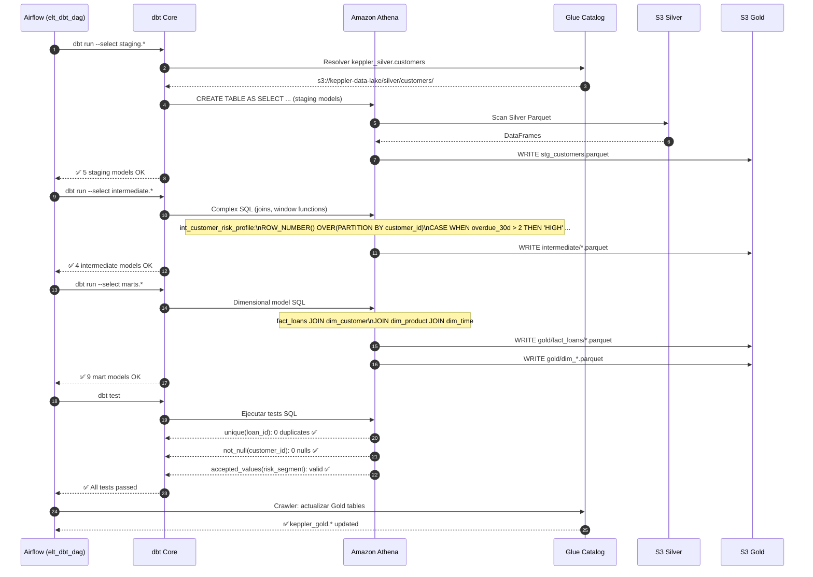

---

## 8. Fase 4 — Capas Analíticas y ML (Diamond)

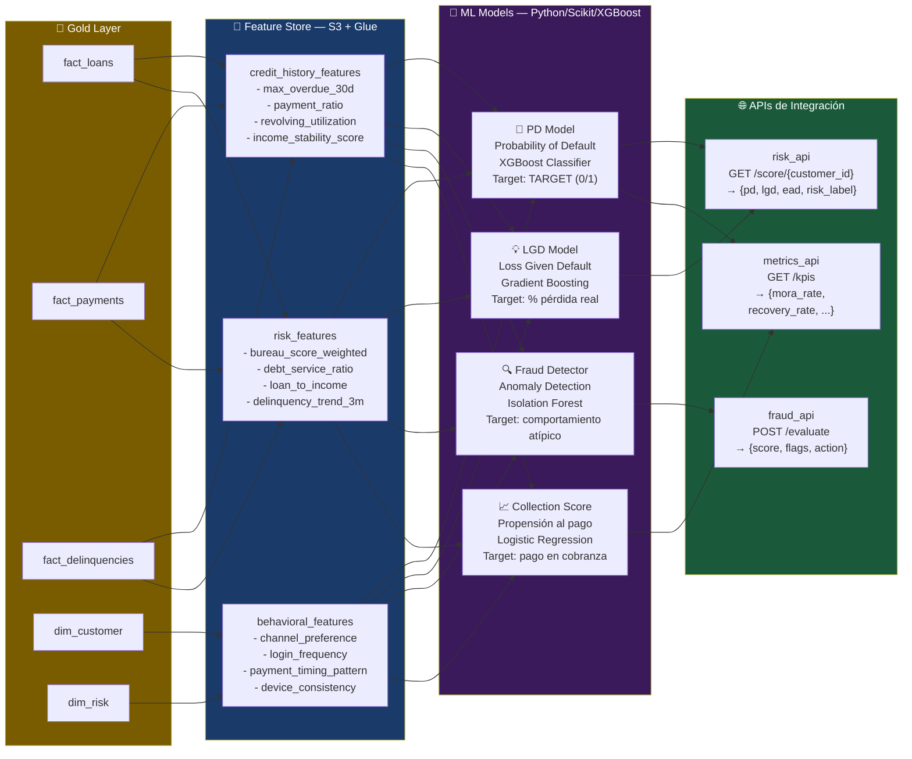

---

## 9. Modelo Dimensional — Star Schema Financiero

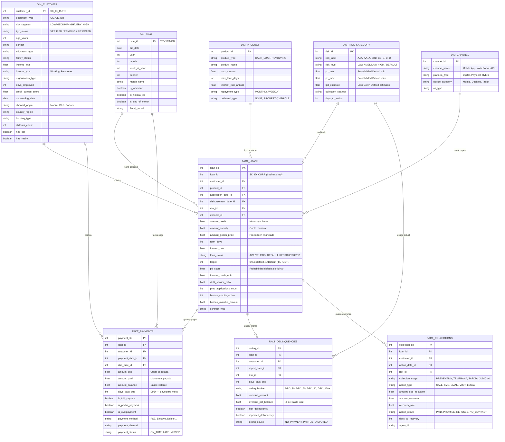

---

## 10. Stack Tecnológico por Capa

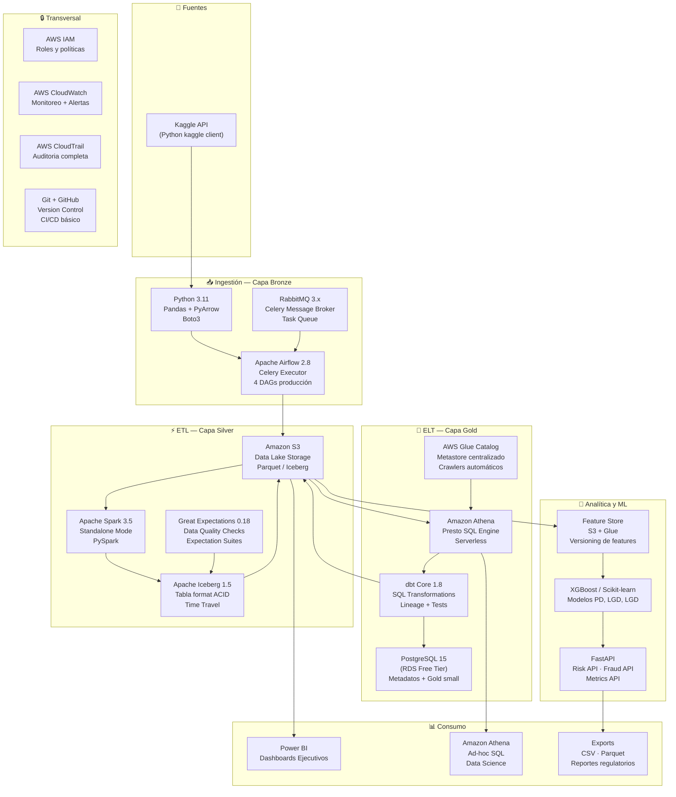

---

## 11. Estructura S3 — Data Lake

```
keppler-data-lake/
│
├── bronze/                              ← Datos crudos, inmutables, por fecha
│   ├── home_credit/
│   │   ├── application/
│   │   │   └── dt=2026-06-15/
│   │   │       ├── part-0000.parquet
│   │   │       ├── part-0001.parquet
│   │   │       └── _metadata.json
│   │   ├── bureau/
│   │   │   └── dt=2026-06-15/*.parquet
│   │   ├── bureau_balance/
│   │   ├── previous_application/
│   │   ├── POS_CASH_balance/
│   │   └── installments_payments/
│   ├── give_me_credit/
│   │   └── training/dt=YYYY-MM-DD/*.parquet
│   ├── lending_club/
│   │   └── loans/dt=YYYY-MM-DD/*.parquet
│   └── loan_prediction/
│       └── train/dt=YYYY-MM-DD/*.parquet
│
├── silver/                              ← Datos limpios, Apache Iceberg
│   ├── customers/                       ← Tabla Iceberg
│   │   ├── data/*.parquet               ← Archivos de datos
│   │   └── metadata/                    ← Iceberg metadata
│   │       ├── snap-*.avro             ← Snapshots
│   │       └── *.json                  ← Manifests
│   ├── loans/
│   ├── payments/
│   ├── bureau_history/
│   └── delinquencies/
│
├── gold/                                ← Star Schema, Parquet optimizado
│   ├── fact_loans/
│   │   └── year=2026/month=06/*.parquet
│   ├── fact_payments/
│   ├── fact_delinquencies/
│   ├── fact_collections/
│   ├── dim_customer/
│   ├── dim_product/
│   ├── dim_time/
│   ├── dim_risk_category/
│   └── dim_channel/
│
├── diamond/                             ← Features y modelos ML
│   ├── feature_store/
│   │   ├── credit_history_features/
│   │   ├── behavioral_features/
│   │   └── risk_features/
│   ├── models/
│   │   ├── pd_model_v1/
│   │   └── fraud_detector_v1/
│   └── analytical_products/
│       └── risk_reports/
│
├── artifacts/                           ← Artefactos de calidad y documentación
│   ├── great_expectations/
│   │   ├── bronze_validation_results/
│   │   └── silver_validation_results/
│   ├── dbt_docs/
│   └── pipeline_logs/
│
└── _manifests/                          ← Manifiesto de ingestión por día
    └── dt=YYYY-MM-DD/
        └── manifest.json
```

---

## 12. Configuración Spark en Free Tier

### 12.1 Parámetros Recomendados (4 GB RAM max por instancia)

```bash
# spark-defaults.conf — Configuración conservadora para free tier

spark.master                     spark://ec2-master-private-ip:7077
spark.deploy.mode                client

# Driver (EC2 Master)
spark.driver.memory              1g
spark.driver.cores               1
spark.driver.maxResultSize       512m

# Executors (Workers)
spark.executor.memory            1500m      # 1.5g — deja 2.5g para OS y Airflow
spark.executor.cores             2
spark.executor.instances         3          # Base: 3 workers siempre disponibles

# Serialización y shuffle
spark.serializer                 org.apache.spark.serializer.KryoSerializer
spark.sql.shuffle.partitions     18         # 2x cores totales (3 workers x 2 cores x 3)
spark.default.parallelism        18

# Manejo de memoria
spark.memory.fraction            0.6        # 60% para ejecución, 40% para storage
spark.memory.storageFraction     0.5
spark.sql.adaptive.enabled       true       # AQE — adaptar particiones automáticamente
spark.sql.adaptive.coalescePartitions.enabled true

# S3 — acceso optimizado
spark.hadoop.fs.s3a.impl                org.apache.hadoop.fs.s3a.S3AFileSystem
spark.hadoop.fs.s3a.fast.upload         true
spark.hadoop.fs.s3a.multipart.size      64m
spark.jars.packages                     org.apache.iceberg:iceberg-spark-runtime-3.5_2.12:1.5.0,\
                                        org.apache.hadoop:hadoop-aws:3.3.4

# Iceberg
spark.sql.catalog.keppler               org.apache.iceberg.spark.SparkCatalog
spark.sql.catalog.keppler.type          glue
spark.sql.catalog.keppler.warehouse     s3://keppler-data-lake/silver/
```

### 12.2 Script de Arranque del Cluster Spark

```bash
#!/bin/bash
# scripts/start_spark_cluster.sh
# Ejecutar en EC2 Master antes del ETL window

MASTER_IP=$(hostname -I | awk '{print $1}')
SPARK_HOME=/opt/spark

# Iniciar Master
$SPARK_HOME/sbin/start-master.sh --host $MASTER_IP --port 7077

# Iniciar Worker en Master también (si hay RAM disponible)
$SPARK_HOME/sbin/start-worker.sh spark://$MASTER_IP:7077 \
  --memory 1g --cores 1

echo "Spark Master iniciado en spark://$MASTER_IP:7077"
echo "UI disponible en http://$MASTER_IP:8080"

# Notificar a workers vía Airflow Variable
python3 -c "
from airflow.models import Variable
Variable.set('spark_master_url', 'spark://$MASTER_IP:7077')
"
```

```bash
#!/bin/bash
# scripts/join_spark_worker.sh
# Ejecutar en Workers, RabbitMQ y Postgres durante ventana ETL

MASTER_IP=$1  # Recibe IP del master como argumento
SPARK_HOME=/opt/spark

$SPARK_HOME/sbin/start-worker.sh spark://$MASTER_IP:7077 \
  --memory 1500m --cores 2

echo "Worker iniciado. Conectado a spark://$MASTER_IP:7077"
```

---

## 13. Cronograma de 2 Semanas

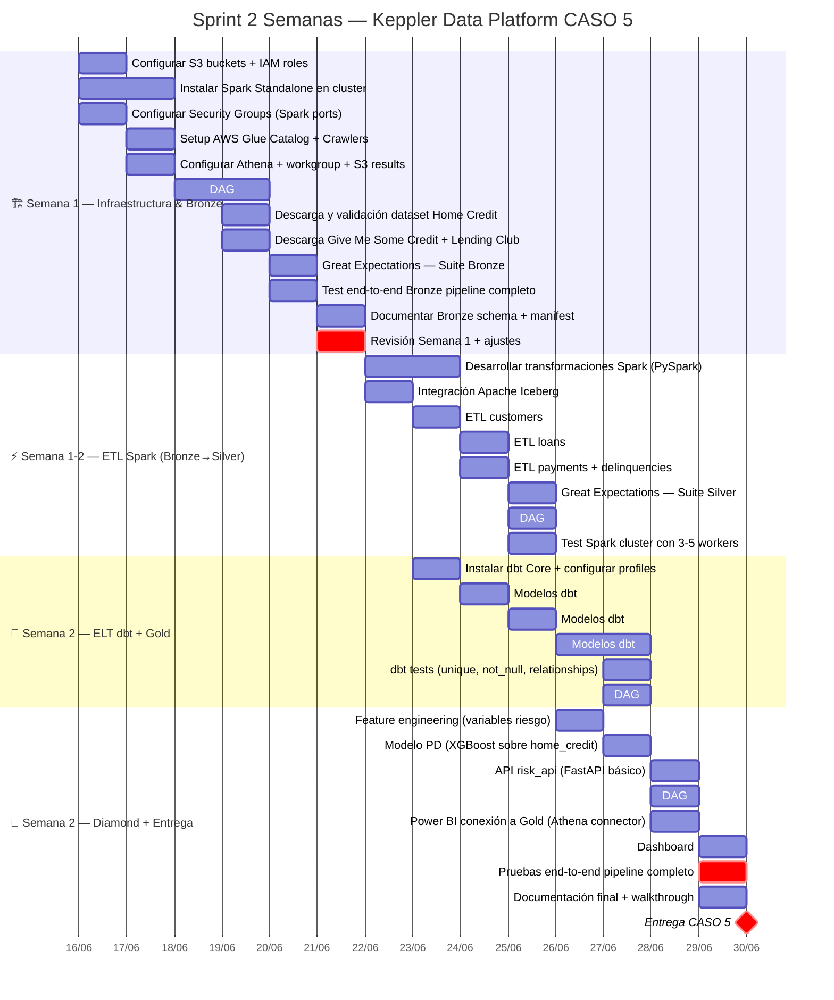

### Tareas Detalladas por Día

| Día | Foco | Entregables |
|-----|------|-------------|
| **Lun 16** | Setup AWS: S3, IAM, Glue, Athena, Spark install | Cluster funcional, buckets creados |
| **Mar 17** | Security Groups, Kaggle API setup, DAG Bronze inicio | Kaggle descarga manual OK |
| **Mié 18** | bronze_pipeline_dag completo (4 datasets) | Bronze con Home Credit completo |
| **Jue 19** | Descarga todos los datasets, GE Bronze Suite | Bronze 100% validado |
| **Vie 20** | Test completo Bronze, ajustes, documentación | Bronze pipeline production-ready |
| **Sáb 21** | Revisión Semana 1, planificación Semana 2 | Review + backlog priorizado |
| **Dom 22** | Descanso / contingencia | — |
| **Lun 23** | dbt install/config + Spark ETL customers/loans | stg_customers, stg_loans OK |
| **Mar 24** | Spark ETL payments + delinq + GE Silver Suite | Silver 80% completo |
| **Mié 25** | Silver completo, intermediate dbt (4 modelos) | int_customer_risk_profile OK |
| **Jue 26** | Marts dbt Star Schema (9 modelos) | fact_loans, dim_customer OK |
| **Vie 27** | dbt tests completos, monitoring_dag, Feature Store | All tests green |
| **Sáb 28** | Modelo PD, risk_api FastAPI, Power BI conexión | API /score/{id} funcionando |
| **Dom 29** | Dashboard final, pruebas E2E, documentación | Entregable completo |
| **Lun 30** | Buffer contingencias + entrega final | ✅ CASO 5 DONE |

---

## Apéndice — KPIs del Dashboard Final

| KPI | Fuente | Frecuencia |
|-----|--------|------------|
| Tasa de Mora 30/60/90 días | fact_delinquencies | Diaria |
| Cartera Vencida (%) | fact_loans + fact_delinquencies | Diaria |
| Probabilidad de Default media por segmento | fact_loans.pd_score | Diaria |
| Tasa de Recuperación en Cobranza | fact_collections | Semanal |
| Ingreso vs Cuota (Debt Service Ratio) | fact_loans | Por origination |
| Aprobaciones vs Rechazos por canal | fact_loans + dim_channel | Diaria |
| Clientes en mora repetida (%) | dim_customer + fact_delinquencies | Semanal |
| Score de Riesgo por segmento | dim_risk_category | Mensual |
| Fraud flags por día | ML Fraud Detector | Tiempo real (via API) |

---

*Propuesta generada para la plataforma Keppler Data Platform*  
*CASO 5 — Descontrol Operacional y Riesgo Crediticio*  
*Junio 2026 — Entorno AWS Free Tier*
