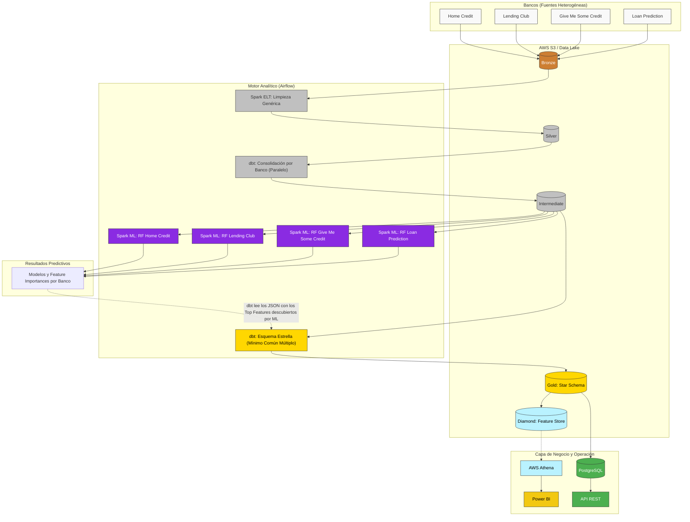

# Plan Estratégico: Arquitectura de Doble Flujo (Dual-Flow)

Este documento redefine la arquitectura y el flujo de datos para resolver el Caso 5. Evolucionamos desde el "Escenario C" original hacia un **Enfoque de Doble Flujo**, separando la lógica de Negocio (BI) de la lógica de Machine Learning para respetar la naturaleza única de los 4 bancos heterogéneos.

## 1. El Reto y La Solución (Por qué cambiamos el rumbo)

**El problema original:** 
Teníamos 4 bancos con columnas totalmente diferentes. El plan anterior proponía usar el banco más complejo (Home Credit) para descubrir un "Top 20" de variables predictivas y obligar a los otros 3 bancos a encajar en esas 20 columnas. 
*El fallo analítico:* Si la variable más predictiva de Home Credit es `EXT_SOURCE_3`, pero *Give Me Some Credit* no tiene esa columna, es imposible filtrarla. Forzar un solo molde arruina el poder predictivo de cada banco.

**La Solución (Arquitectura de Doble Flujo):**
Separamos los objetivos en dos caminos independientes que nacen desde la capa Silver:

1. **Flujo de Negocio (BI / Data Warehouse):** Usamos **dbt** para buscar el *Mínimo Común Múltiplo* entre los 4 bancos. Extraemos **solo conceptos universales** (edad, ingresos, monto del préstamo, estado de mora) para construir un Esquema Estrella estandarizado (`DIM_CUSTOMER`, `FACT_LOAN`). Esto permite a la gerencia ver reportes globales en Power BI.
2. **Flujo de Machine Learning (Spark ML):** No forzamos moldes. Entrenamos **4 modelos de Random Forest independientes**, uno para cada banco, aprovechando el 100% de las columnas nativas de cada dataset. Esto maximiza la precisión predictiva para cada institución.

## 2. Diagrama de Flujo y Arquitectura Dual

El siguiente diagrama ilustra cómo la capa `Intermediate` se bifurca: el camino SQL (dbt) hacia la capa Gold para analítica, y el camino Python (Spark) hacia el entrenamiento de modelos.

## 3. ¿Alcanzaremos el "Modelo Esperado" (Esquema Estrella)?

**Sí.** Cumpliremos con la estructura de `FACT_LOAN` y `DIM_CUSTOMER`.
Sin embargo, en lugar de llenarlos con adivinanzas o forzar columnas incompatibles, el Esquema Estrella contendrá **estrictamente los conceptos demográficos y financieros universales** compartidos por los 4 bancos. 

## 4. El Flujo hacia la API (El Mundo Transaccional)

El Data Warehouse (Diamond en S3) es perfecto para Power BI, pero ineficiente para consultar *un solo cliente* en tiempo real. 

Por eso la arquitectura define el paso final: **PostgreSQL**.
1. Cada noche, Airflow tomará la versión final de `DIM_CUSTOMER` y `FACT_LOAN` y hará un volcado (UPSERT) a nuestra base de datos PostgreSQL.
2. Construiremos una **API REST (con FastAPI o Supabase)** conectada a PostgreSQL.
3. Cuando el Banco A quiera prestarle dinero a "Juan Pérez", su sistema consultará nuestra API. Ésta responderá en milisegundos si Juan tiene créditos activos en otros bancos y su perfil de riesgo.

---

## 5. Hoja de Ruta (Roadmap de Ejecución)

### Fase 1: Limpieza e Ingesta (COMPLETADA ✅)
*   [x] Transformación Bronze a Silver (Parquet, limpieza de nulos, estandarización básica).
*   [x] Configuración dinámica de DAGs en Airflow para procesar masivamente sin `TIME_WAIT`.

### Fase 2: Consolidación de Negocio - dbt (ACTUAL ⏳)
*   [ ] Crear modelos dbt (`intermediate/`) para mapear las columnas de cada banco hacia los "Conceptos Universales" (Target, Edad, Ingresos, Monto).
*   [ ] Crear modelos dbt de Esquema Estrella (`marts/dim_customer`, `marts/fact_loan`) uniendo (UNION ALL) los 4 bancos estandarizados.

### Fase 3: Descubrimiento Machine Learning - Spark ML (PRÓXIMO 🎯)
*   [ ] Desarrollar script genérico en Spark ML (`intermediate_feature_selection.py`) que reciba el nombre del banco, aísle su variable `target` para evitar Data Leakage, y entrene un Random Forest.
*   [ ] Orquestar en Airflow el entrenamiento en paralelo/secuencial de los 4 modelos y guardar las métricas de importancia en S3.

### Fase 4: Activación y Operación (FUTURO 🚀)
*   [ ] Desplegar la base de datos PostgreSQL (OLTP).
*   [ ] Crear script en Airflow (`diamond_to_postgres.py`) para sincronizar datos a PostgreSQL.
*   [ ] Desarrollar la API REST en FastAPI y documentar el Swagger.
