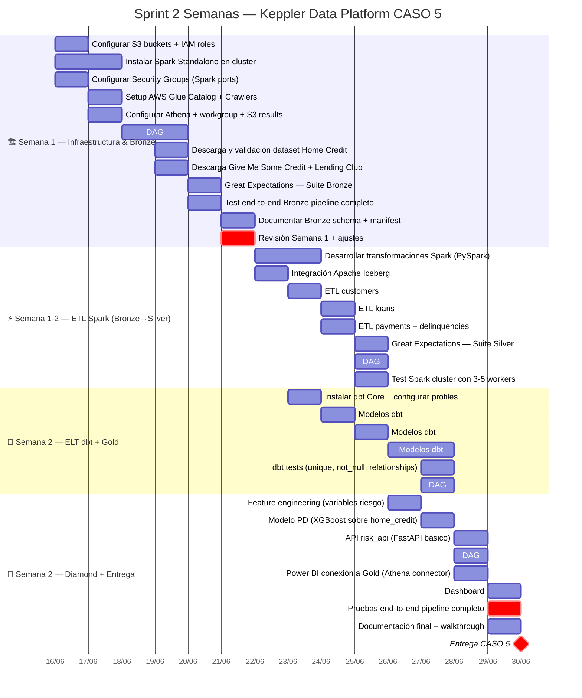

# 🚀 KEPPLER DATA PLATFORM — Guía de Equipo
### CASO 5 · Sprint 2 Semanas · Inicio: 16 Junio 2026

---

## ⚡ Quick Reference — Lo que estamos construyendo

> **Misión:** Pasar datos de Kaggle (créditos, pagos, mora) a un pipeline de datos completo en AWS, capaz de predecir riesgo crediticio y detectar fraude.

### Stack en una línea

```
Kaggle → Python/Airflow → S3 Bronze → Spark ETL → S3 Silver (Iceberg) → dbt+Athena → Gold (Star Schema) → Power BI + ML API
```

### Nuestro Cluster (Free Tier — máx 4 GB RAM por instancia)

| Instancia | Nombre | Rol Principal | Rol en ETL Spark |
|-----------|--------|--------------|-----------------|
| EC2 Master | `airflow-master` | Airflow Scheduler + UI | Spark Master + Driver |
| EC2 Worker 1 | `airflow-worker-1` | Celery Worker | Spark Executor (1.5g) |
| EC2 Worker 2 | `airflow-worker-2` | Celery Worker | Spark Executor (1.5g) |
| EC2 Worker 3 | `airflow-worker-3` | Celery Worker | Spark Executor (1.5g) |
| EC2 RabbitMQ | `rabbitmq` | Cola de tareas Celery | Spark Executor adhoc (1.5g) |
| EC2 Postgres | `postgres` | Metadata Airflow | Spark Executor adhoc (1.0g) |
| EC2 Nginx | `proxy` | Acceso público UI | Sin cambios |

### Capas del Data Lake (S3: `keppler-data-lake`)

| Capa | Carpeta S3 | Formato | Cuándo |
|------|-----------|---------|--------|
| 🟫 **Bronze** | `/bronze/` | Parquet raw | Cada 6h (Airflow) |
| 🥈 **Silver** | `/silver/` | Apache Iceberg | Diario 02:00 (Spark) |
| 🥇 **Gold** | `/gold/` | Parquet Star Schema | Diario 05:00 (dbt+Athena) |
| 💎 **Diamond** | `/diamond/` | Parquet + modelos pkl | Semanal (ML pipeline) |

### Datasets a ingestar (Kaggle)

| Dataset | Tablas clave | Filas aprox. | Worker asignado |
|---------|-------------|-------------|-----------------|
| Home Credit Default Risk | application, bureau, payments, POS | ~14M total | Worker 1 |
| Give Me Some Credit | cs-training | 150k | Worker 2 |
| Lending Club | loan | 2.2M | Worker 3 |
| Loan Prediction | train | 615 | Worker 1 ó 2 |

---

## 🗓️ Cronograma del Sprint



---

## 📋 Historias de Usuario

> **Roles en el equipo:**
> - 🔧 **Data Engineer (DE):** Infraestructura, pipelines, Airflow, Spark
> - 🔬 **Data Analyst (DA):** dbt, modelos dimensionales, calidad de datos
> - 🤖 **ML Engineer (ML):** Features, modelos, APIs
> - 📊 **BI Analyst (BI):** Dashboards, KPIs, reportes

---

### 📦 ÉPICA 1 — Infraestructura Base

---

#### HU-01 · S3 Data Lake Setup
**Día:** Lunes 16 · **Rol:** 🔧 DE · **Prioridad:** 🔴 Crítica

> *Como Data Engineer, quiero tener los buckets S3 configurados con la estructura de carpetas correcta y los permisos IAM adecuados, para que todos los pipelines tengan un destino seguro y organizado donde escribir y leer datos.*

**Criterios de Aceptación:**
- [ ] Bucket `keppler-data-lake` creado en la región correcta
- [ ] Carpetas `/bronze/`, `/silver/`, `/gold/`, `/diamond/`, `/artifacts/` creadas
- [ ] Rol IAM `keppler-pipeline-role` con políticas S3 read/write + Glue + Athena
- [ ] Rol IAM `keppler-airflow-role` para las EC2 workers
- [ ] Política de lifecycle: Bronze se retiene 90 días, Silver 1 año
- [ ] Versioning activado en el bucket
- [ ] Test: subir y descargar un archivo .parquet de prueba desde EC2

**Comandos útiles:**
```bash
# Crear bucket
aws s3 mb s3://keppler-data-lake --region us-east-1

# Verificar estructura
aws s3 ls s3://keppler-data-lake/ --recursive

# Test de escritura desde EC2
aws s3 cp test.parquet s3://keppler-data-lake/bronze/test/
```

---

#### HU-02 · Spark Standalone en Cluster
**Día:** Lunes-Martes 16-17 · **Rol:** 🔧 DE · **Prioridad:** 🔴 Crítica

> *Como Data Engineer, quiero instalar y configurar Apache Spark en modo Standalone sobre el cluster EC2 existente, para poder ejecutar transformaciones distribuidas en la ventana nocturna sin contratar servicios adicionales de AWS.*

**Criterios de Aceptación:**
- [ ] Spark 3.5 instalado en todas las instancias EC2 (`/opt/spark`)
- [ ] `spark-defaults.conf` con `executor.memory=1500m`, `driver.memory=1g`
- [ ] `start-master.sh` ejecuta sin errores en EC2 Master
- [ ] Los 3 Workers se conectan al Master (`spark://master-ip:7077`)
- [ ] Spark UI accesible en `:8080` (vía Nginx proxy)
- [ ] Script `join_spark_worker.sh` funciona en RabbitMQ y Postgres EC2
- [ ] Test: `spark-submit examples/pi.py` completa correctamente
- [ ] Librerías S3 y Iceberg disponibles en el classpath

**Config clave:**
```bash
# spark-defaults.conf
spark.executor.memory              1500m
spark.driver.memory                1g
spark.sql.shuffle.partitions       18
spark.sql.adaptive.enabled         true
spark.serializer                   org.apache.spark.serializer.KryoSerializer
```

---

#### HU-03 · Security Groups y Red
**Día:** Lunes 16 · **Rol:** 🔧 DE · **Prioridad:** 🔴 Crítica

> *Como Data Engineer, quiero que los Security Groups de AWS permitan la comunicación entre instancias para Spark, sin exponer puertos innecesarios al internet, para garantizar que el cluster funcione de forma segura en la subnet privada.*

**Criterios de Aceptación:**
- [ ] Puerto `7077` (Spark Master) abierto entre todas las EC2 privadas
- [ ] Puerto `8080` (Spark UI) accesible vía Nginx proxy únicamente
- [ ] Puerto `4040-4045` (Spark Driver/Jobs UI) accesible internamente
- [ ] Puerto `7078` (Spark Worker) abierto entre EC2 privadas
- [ ] Ningún puerto Spark expuesto directamente al internet
- [ ] Test: `nc -zv master-private-ip 7077` desde cada worker retorna OK

---

#### HU-04 · AWS Glue Catalog + Athena
**Día:** Martes 17 · **Rol:** 🔧 DE · **Prioridad:** 🔴 Crítica

> *Como Data Engineer y Data Analyst, quiero tener el catálogo de Glue configurado con las bases de datos del Data Lake, y Athena apuntando al bucket S3 correcto, para que dbt pueda ejecutar transformaciones SQL sin servidor sobre los datos en S3.*

**Criterios de Aceptación:**
- [ ] Bases de datos Glue creadas: `keppler_bronze`, `keppler_silver`, `keppler_gold`
- [ ] Athena workgroup `keppler-workgroup` creado
- [ ] Resultados de Athena → `s3://keppler-data-lake/artifacts/athena-results/`
- [ ] Crawler de Glue `crawler-silver` apuntando a `/silver/` (listo para correr post-ETL)
- [ ] Crawler de Glue `crawler-gold` apuntando a `/gold/`
- [ ] Test: query Athena `SELECT 1` completa sin error
- [ ] Límite de costo Athena configurado en Workgroup (protección free tier)

---

### 📥 ÉPICA 2 — Ingestión Bronze (Kaggle → S3)

---

#### HU-05 · DAG Bronze — Ingestión Paralela Kaggle
**Día:** Miércoles-Jueves 18-19 · **Rol:** 🔧 DE · **Prioridad:** 🔴 Crítica

> *Como Data Engineer, quiero un DAG de Airflow que descargue todos los datasets de Kaggle en paralelo usando los 3 workers, los convierta a Parquet por chunks y los suba a S3 Bronze, para no saturar la RAM de ninguna instancia y tener los datos disponibles para el ETL.*

**Criterios de Aceptación:**
- [ ] DAG `bronze_pipeline_dag` creado en `airflow/dags/`
- [ ] Descarga de 4 datasets en paralelo (un task group por dataset)
- [ ] Lectura en chunks de máx 50,000 filas (configurable por variable Airflow)
- [ ] Conversión CSV → Parquet con compresión Snappy
- [ ] Particionado por `dt=YYYY-MM-DD` en S3
- [ ] Task `validate_bronze` verifica row count y checksum post-carga
- [ ] Task `write_manifest` genera `_metadata.json` por cada carga
- [ ] Reintentos automáticos (3 reintentos, backoff 5 min)
- [ ] Alerta por email/Slack si falla la validación

**Estructura del DAG:**
```python
# Pseudocódigo de la estructura
bronze_pipeline_dag:
  ├── download_home_credit     (Worker 1)
  ├── download_give_me_credit  (Worker 2)
  ├── download_lending_club    (Worker 3)
  ├── download_loan_prediction (Worker 1|2)
  └── [join] validate_bronze → write_manifest → notify_success
```

---

#### HU-06 · Descarga y Validación Home Credit
**Día:** Jueves 19 · **Rol:** 🔧 DE · **Prioridad:** 🔴 Crítica

> *Como Data Engineer, quiero descargar el dataset principal Home Credit Default Risk (7 tablas, ~14M filas en total) y validar que todos los archivos llegaron íntegros a S3 Bronze, porque es la fuente principal del modelo de riesgo crediticio.*

**Criterios de Aceptación:**
- [ ] 7 tablas descargadas: `application_train`, `bureau`, `bureau_balance`, `previous_application`, `POS_CASH_balance`, `installments_payments`, `credit_card_balance`
- [ ] Ningún chunk supera 50k filas en memoria simultánea
- [ ] Row count de S3 coincide con row count del CSV original ±0.1%
- [ ] Archivos en: `s3://keppler-data-lake/bronze/home_credit/{tabla}/dt=2026-06-19/`
- [ ] Manifest escrito con: `{tabla, filas, archivos, bytes, checksum, timestamp}`
- [ ] El dataset más grande (`bureau_balance`, ~27M filas) completa sin OOM error

---

#### HU-07 · Great Expectations Suite Bronze
**Día:** Viernes 20 · **Rol:** 🔧 DE + 🔬 DA · **Prioridad:** 🟡 Alta

> *Como Data Analyst, quiero que Great Expectations valide automáticamente cada carga a Bronze, para detectar datos corruptos, columnas faltantes o cambios de schema antes de procesarlos con Spark.*

**Criterios de Aceptación:**
- [ ] Suite `bronze_application_suite` creada con expectativas:
  - `SK_ID_CURR`: not null, unique, tipo int
  - `TARGET`: valores solo en {0, 1}
  - `AMT_CREDIT`: entre 0 y 10,000,000
  - `DAYS_BIRTH`: entre -25000 y -6000 (18-70 años)
  - `AMT_INCOME_TOTAL`: entre 0 y 100,000,000
- [ ] Suite `bronze_bureau_suite` creada
- [ ] Suite `bronze_payments_suite` creada
- [ ] Reportes HTML de validación en `s3://keppler-data-lake/artifacts/great_expectations/bronze/`
- [ ] Si alguna suite falla → DAG marca task como FAILED y no avanza al ETL

---

#### HU-08 · Test E2E Pipeline Bronze
**Día:** Viernes 20 · **Rol:** 🔧 DE · **Prioridad:** 🟡 Alta

> *Como equipo, queremos correr el pipeline Bronze completo de punta a punta y confirmar que los 4 datasets llegan a S3 con sus validaciones pasadas, para cerrar la Semana 1 con confianza y arrancar el ETL.*

**Criterios de Aceptación:**
- [ ] DAG `bronze_pipeline_dag` corre completamente sin intervención manual
- [ ] Los 4 datasets están en S3 Bronze correctamente particionados
- [ ] Great Expectations: 0 validaciones fallidas en Bronze
- [ ] Manifests escritos para cada tabla
- [ ] Tiempo total de ejecución documentado (benchmark)
- [ ] Log de Airflow sin errores críticos
- [ ] Revisión de Semana 1 realizada con el equipo

---

### ⚡ ÉPICA 3 — ETL Spark (Bronze → Silver Iceberg)

---

#### HU-09 · ETL Customers: Deduplicación y Normalización
**Día:** Lunes-Martes 22-23 · **Rol:** 🔧 DE · **Prioridad:** 🔴 Crítica

> *Como Data Engineer, quiero transformar los datos crudos de clientes (application_train) con Spark, deduplicando por ID de cliente, limpiando nulos, normalizando tipos y calculando ratios financieros clave, para que Silver tenga una fuente confiable del perfil de cada cliente.*

**Criterios de Aceptación:**
- [ ] Spark job `etl_customers.py` lee `bronze/home_credit/application/`
- [ ] Deduplicación por `SK_ID_CURR` (mantener registro más reciente)
- [ ] Imputación de nulos: numéricos con mediana, categóricos con moda
- [ ] Columnas calculadas:
  - `income_credit_ratio = AMT_INCOME_TOTAL / AMT_CREDIT`
  - `annuity_income_ratio = AMT_ANNUITY / AMT_INCOME_TOTAL`
  - `debt_service_ratio = (AMT_ANNUITY * 12) / AMT_INCOME_TOTAL`
  - `age_years = abs(DAYS_BIRTH) / 365`
  - `employment_years = abs(DAYS_EMPLOYED) / 365` (si > 0)
  - `risk_segment` = categoría basada en reglas de negocio
- [ ] Escribe en `s3://keppler-data-lake/silver/customers/` formato Iceberg
- [ ] Great Expectations Suite Silver valida el resultado
- [ ] Registro en Glue Catalog: `keppler_silver.customers`

---

#### HU-10 · ETL Loans: Joins y Enriquecimiento
**Día:** Martes-Miércoles 23-24 · **Rol:** 🔧 DE · **Prioridad:** 🔴 Crítica

> *Como Data Engineer, quiero hacer los joins entre application, bureau y previous_application en Spark, para enriquecer cada solicitud de crédito con el historial crediticio externo del cliente antes de guardarlo en Silver.*

**Criterios de Aceptación:**
- [ ] Join: `application LEFT JOIN bureau ON SK_ID_CURR`
- [ ] Agregados de bureau por cliente:
  - `bureau_credits_active`: count de créditos activos
  - `bureau_overdue_amount`: suma de mora actual
  - `bureau_max_overdue_days`: máximo días vencidos histórico
  - `bureau_credit_score_avg`: promedio scores externos
- [ ] Join con `previous_application`: count de solicitudes previas, tasa de aprobación
- [ ] Columna `has_bureau_history` (boolean)
- [ ] Escribe en `silver/loans/` formato Iceberg particionado por `TARGET`
- [ ] Great Expectations valida: no nulls en `SK_ID_CURR`, tipos correctos
- [ ] Registro en Glue: `keppler_silver.loans`

---

#### HU-11 · ETL Payments y Delinquencies
**Día:** Miércoles 24 · **Rol:** 🔧 DE · **Prioridad:** 🔴 Crítica

> *Como Data Engineer, quiero transformar los historiales de pagos e installments con Spark, calculando los días de mora (DPD) y clasificando en buckets, para que el modelo de riesgo tenga features de comportamiento de pago confiables.*

**Criterios de Aceptación:**
- [ ] Procesa `installments_payments` (13M filas) sin OOM — usar particiones ≥18
- [ ] Calcula `days_past_due = DAYS_INSTALMENT - DAYS_ENTRY_PAYMENT` (si > 0)
- [ ] Clasifica en buckets: `DPD_0`, `DPD_1_30`, `DPD_31_60`, `DPD_61_90`, `DPD_90+`
- [ ] Agrega por cliente: `max_dpd_ever`, `count_late_payments`, `avg_payment_ratio`
- [ ] Procesa `POS_CASH_balance` para mora en préstamos POS
- [ ] Escribe `silver/payments/` y `silver/delinquencies/` en Iceberg
- [ ] Ambas tablas registradas en Glue Catalog

---

#### HU-12 · DAG etl_spark_dag + Cluster Completo
**Día:** Jueves 25 · **Rol:** 🔧 DE · **Prioridad:** 🔴 Crítica

> *Como Data Engineer, quiero un DAG de Airflow que orqueste todo el ETL Spark (levantar el cluster, ejecutar los jobs en orden, apagar workers adhoc al terminar), para que el proceso sea automático, monitoreado y repetible.*

**Criterios de Aceptación:**
- [ ] DAG `etl_spark_dag` con schedule `0 2 * * *` (2 AM diario)
- [ ] Task `start_spark_cluster`: ejecuta script en EC2 Master vía SSH
- [ ] Task `join_adhoc_workers`: invita a RabbitMQ y Postgres EC2 como workers Spark
- [ ] Task group `etl_jobs`: ejecuta en orden: customers → loans → payments → delinquencies
- [ ] Task `validate_silver`: corre Great Expectations Silver suites
- [ ] Task `update_glue_catalog`: lanza crawlers para actualizar tablas
- [ ] Task `stop_adhoc_workers`: libera RabbitMQ y Postgres al finalizar
- [ ] SLA: todo el ETL completa en menos de 2 horas
- [ ] Alerta si algún job Spark falla

**Flujo del DAG:**
```
start_spark_cluster
    → join_adhoc_workers
        → etl_customers → etl_loans → etl_payments → etl_delinquencies
            → validate_silver
                → update_glue_catalog
                    → stop_adhoc_workers
                        → notify_success
```

---

### 🔄 ÉPICA 4 — ELT dbt + Athena (Silver → Gold)

---

#### HU-13 · Setup dbt Core + Profiles
**Día:** Lunes 23 · **Rol:** 🔬 DA · **Prioridad:** 🔴 Crítica

> *Como Data Analyst, quiero instalar dbt Core con el adaptador de Athena y configurar los profiles correctamente, para poder ejecutar modelos SQL sobre los datos de Silver sin necesitar infraestructura adicional.*

**Criterios de Aceptación:**
- [ ] `dbt-core` y `dbt-athena-community` instalados en EC2 Master (o Worker dedicado)
- [ ] `profiles.yml` configurado con:
  - `s3_staging_dir`: `s3://keppler-data-lake/artifacts/athena-results/`
  - `database`: `awsdatacatalog`
  - `schema`: `keppler_gold`
  - `region_name`: región del proyecto
- [ ] `dbt_project.yml` creado en `marts/`
- [ ] `dbt debug` completa sin errores
- [ ] `dbt compile` compila sin errores
- [ ] Test: `dbt run --select my_first_dbt_model` (modelo de prueba) funciona

---

#### HU-14 · Modelos dbt Staging (5 modelos)
**Día:** Martes 24 · **Rol:** 🔬 DA · **Prioridad:** 🔴 Crítica

> *Como Data Analyst, quiero crear los 5 modelos de staging en dbt que mapeen 1 a 1 con las tablas de Silver, estandarizando nombres de columnas y tipos, para que los modelos intermedios tengan una base limpia y predecible sobre la cual construir.*

**Criterios de Aceptación:**
- [ ] `stg_customers.sql`: SELECT + renombrar columnas a snake_case semántico
- [ ] `stg_loans.sql`: cast tipos, renombrar, filtrar registros válidos
- [ ] `stg_payments.sql`: normalizar fechas, renombrar
- [ ] `stg_bureau_history.sql`: agregar bureau por cliente
- [ ] `stg_delinquencies.sql`: clasificar DPD buckets si no viene de Silver
- [ ] Todos los modelos tienen `config(materialized='view')` (económico en Athena)
- [ ] `schema.yml` con descripciones de cada tabla y columna
- [ ] `dbt run --select staging.*` ejecuta sin errores

---

#### HU-15 · Modelos dbt Intermediate (Business Logic)
**Día:** Miércoles 25 · **Rol:** 🔬 DA · **Prioridad:** 🔴 Crítica

> *Como Data Analyst, quiero crear los modelos intermedios que aplican lógica de negocio financiero (segmentación de riesgo, perfil de comportamiento de pago, funnel de cobranza), para que los marts finales reflejen la realidad del negocio.*

**Criterios de Aceptación:**
- [ ] `int_customer_risk_profile.sql`:
  - Combina stg_customers + stg_bureau_history
  - Calcula `risk_score` basado en: DPD máximo, ratio deuda/ingreso, historial
  - Asigna `risk_segment`: LOW / MEDIUM / HIGH / VERY_HIGH
- [ ] `int_loan_enriched.sql`:
  - Join loans + bureau + customer_risk_profile
  - Columna `is_high_risk_loan` (boolean)
  - Columna `expected_loss = AMT_CREDIT * pd_estimate * lgd_estimate`
- [ ] `int_payment_behavior.sql`:
  - Patrón de pago por cliente (% de pagos a tiempo, promedio DPD)
  - Window function: `ROW_NUMBER()` para historial temporal
- [ ] `int_collection_funnel.sql`:
  - Estado de cobranza: PREVENTIVA / TEMPRANA / TARDÍA / JUDICIAL
  - Basado en bucket de mora y días sin pago
- [ ] `dbt run --select intermediate.*` sin errores
- [ ] Tests básicos: `not_null`, `unique` en IDs

---

#### HU-16 · Modelos dbt Marts — Star Schema Gold
**Día:** Jueves-Viernes 26-27 · **Rol:** 🔬 DA · **Prioridad:** 🔴 Crítica

> *Como Data Analyst, quiero construir el Star Schema completo con 5 tablas de hechos y 5 dimensiones en la capa Gold, para que Power BI y el equipo de negocio puedan analizar mora, riesgo, cobranza y comportamiento de clientes con consultas simples y eficientes.*

**Criterios de Aceptación:**

**Dimensiones** (materialized: `table`):
- [ ] `dim_customer.sql`: perfil único por cliente, una fila = un cliente
- [ ] `dim_product.sql`: tipos de crédito disponibles
- [ ] `dim_time.sql`: calendario completo 2015-2026 con festivos Colombia
- [ ] `dim_risk_category.sql`: segmentos LOW/MEDIUM/HIGH/VERY_HIGH con rangos PD
- [ ] `dim_channel.sql`: canales digitales de originación

**Hechos** (materialized: `incremental`):
- [ ] `fact_loans.sql`: 1 fila = 1 crédito, foreign keys a todas las dims
- [ ] `fact_payments.sql`: 1 fila = 1 pago, con `days_past_due` calculado
- [ ] `fact_delinquencies.sql`: 1 fila = 1 evento de mora, bucket DPD
- [ ] `fact_collections.sql`: 1 fila = 1 acción de cobranza, resultado

**Validaciones:**
- [ ] `dbt run --select marts.*` sin errores
- [ ] Tablas visibles en Glue Catalog bajo `keppler_gold`
- [ ] Query de prueba en Athena retorna resultados correctos:
  ```sql
  SELECT risk_segment, COUNT(*) as loans, AVG(pd_score) as avg_pd
  FROM keppler_gold.fact_loans fl
  JOIN keppler_gold.dim_customer dc ON fl.customer_id = dc.customer_id
  GROUP BY 1 ORDER BY 3 DESC
  ```

---

#### HU-17 · dbt Tests + DAG elt_dbt_dag
**Día:** Viernes 27 · **Rol:** 🔬 DA + 🔧 DE · **Prioridad:** 🟡 Alta

> *Como Data Analyst, quiero que dbt corra tests de calidad automáticos en cada ejecución, y que el DAG de Airflow orqueste todo el proceso ELT (dbt run + dbt test + actualizar Glue), para detectar regresiones de calidad antes de que lleguen al dashboard.*

**Criterios de Aceptación:**
- [ ] Tests configurados en `schema.yml`:
  - `unique`: `customer_id` en dim_customer, `loan_id` en fact_loans
  - `not_null`: todas las foreign keys en tablas de hechos
  - `accepted_values`: `risk_segment` in ('LOW','MEDIUM','HIGH','VERY_HIGH')
  - `relationships`: `fact_loans.customer_id` → `dim_customer.customer_id`
- [ ] `dbt test` pasa con 0 errores
- [ ] DAG `elt_dbt_dag` con schedule `0 5 * * *` (5 AM, después del ETL Spark)
- [ ] Flujo: `dbt run staging` → `dbt run intermediate` → `dbt run marts` → `dbt test` → `update glue crawler`
- [ ] Si `dbt test` falla → DAG falla y alerta al equipo

---

### 💎 ÉPICA 5 — Diamond: ML, APIs y Dashboards

---

#### HU-18 · Feature Engineering para Riesgo Crediticio
**Día:** Jueves 26 · **Rol:** 🤖 ML · **Prioridad:** 🟡 Alta

> *Como ML Engineer, quiero construir las features de entrenamiento a partir de las tablas Gold, calculando variables predictoras de incumplimiento de pago, para alimentar el modelo XGBoost de probabilidad de default (PD).*

**Criterios de Aceptación:**
- [ ] Script `ml/datasets/build_credit_features.py` creado
- [ ] Lee desde `keppler_gold.fact_loans` + `dim_customer` + `fact_payments`
- [ ] Features mínimas (20+):
  - Financieras: `income_credit_ratio`, `debt_service_ratio`, `annuity_income_ratio`
  - Comportamiento: `max_dpd_ever`, `count_late_payments_12m`, `payment_ratio_avg`
  - Bureau: `bureau_credits_active`, `bureau_overdue_amount`, `bureau_max_overdue`
  - Demográficas: `age_years`, `employment_years`, `education_encoded`, `family_status_encoded`
  - Producto: `credit_term_days`, `credit_amount_log`, `loan_type_encoded`
- [ ] Dataset de entrenamiento guardado en `s3://keppler-data-lake/diamond/feature_store/credit_features/`
- [ ] Formato Parquet con columna `TARGET` como label
- [ ] Split train/test 80/20 estratificado por TARGET

---

#### HU-19 · Modelo PD — Probabilidad de Default
**Día:** Viernes 27 · **Rol:** 🤖 ML · **Prioridad:** 🟡 Alta

> *Como ML Engineer, quiero entrenar un modelo XGBoost de probabilidad de default (PD) con los datos de Home Credit, para que la API de riesgo pueda devolver un score confiable por cliente.*

**Criterios de Aceptación:**
- [ ] Script `ml/training/train_pd_model.py` creado
- [ ] Modelo: XGBoostClassifier con búsqueda de hiperparámetros básica
- [ ] Métrica objetivo: AUC-ROC ≥ 0.70 en test set
- [ ] Reporte de evaluación: AUC, Gini, KS statistic, tabla de clasificación por decil
- [ ] Modelo serializado en `s3://keppler-data-lake/diamond/models/pd_model_v1/model.pkl`
- [ ] Feature importance guardada (top 20 features)
- [ ] Notebook de evaluación en `ml/evaluation/pd_model_evaluation.ipynb`

---

#### HU-20 · API de Riesgo (FastAPI)
**Día:** Sábado 28 · **Rol:** 🤖 ML · **Prioridad:** 🟡 Alta

> *Como equipo de integración, quiero una API REST que reciba un ID de cliente y retorne su score de riesgo, segmento y recomendación, para que sistemas externos puedan consumir el modelo de forma programática.*

**Criterios de Aceptación:**
- [ ] FastAPI app en `integration/api/risk_api/main.py`
- [ ] Endpoint `GET /score/{customer_id}` retorna:
  ```json
  {
    "customer_id": 100001,
    "pd_score": 0.14,
    "risk_segment": "MEDIUM",
    "risk_label": "BB",
    "recommendation": "APPROVE_WITH_CONDITIONS",
    "top_risk_factors": ["high_debt_service_ratio", "previous_delinquency"],
    "model_version": "pd_model_v1"
  }
  ```
- [ ] Endpoint `GET /health` retorna status 200
- [ ] Endpoint `GET /metrics` retorna KPIs básicos del portfolio
- [ ] Tiempo de respuesta < 500ms por request
- [ ] Documentación automática en `/docs` (Swagger)
- [ ] Desplegado en EC2 Master (accesible vía Nginx)

---

#### HU-21 · Monitoring DAG + Alertas
**Día:** Sábado 28 · **Rol:** 🔧 DE · **Prioridad:** 🟡 Alta

> *Como Data Engineer, quiero un DAG de monitoreo que verifique cada 30 minutos que los datos están frescos, los pipelines están corriendo y los SLAs se cumplen, para detectar problemas antes de que el equipo de negocio los note.*

**Criterios de Aceptación:**
- [ ] DAG `monitoring_dag` con schedule `*/30 * * * *`
- [ ] Checks:
  - Freshness: Bronze no tiene más de 8 horas sin datos nuevos
  - Freshness: Silver no tiene más de 26 horas sin actualización
  - Row count: `fact_loans` en Gold tiene más de 300,000 filas
  - Spark: verificar que Master no está caído (si hay ETL activo)
  - Athena: query de salud en keppler_gold
- [ ] Si algún check falla → email de alerta al equipo
- [ ] Dashboard de estado en Airflow UI (log de checks)

---

#### HU-22 · Power BI — Dashboard Ejecutivo de Riesgo
**Día:** Sábado-Domingo 28-29 · **Rol:** 📊 BI · **Prioridad:** 🟡 Alta

> *Como equipo de negocio, queremos un dashboard en Power BI que muestre los KPIs clave de mora, riesgo crediticio y cobranza, para tomar decisiones informadas sobre el portafolio de créditos.*

**Criterios de Aceptación:**
- [ ] Conexión Power BI → Athena configurada (usando Amazon Athena ODBC driver)
- [ ] Página 1 — **Resumen Ejecutivo:**
  - Tasa de mora 30/60/90 días (cards)
  - Cartera vencida total ($) vs cartera activa
  - Distribución por segmento de riesgo (donut chart)
  - Trend de nuevos créditos vs defaults (línea mensual)
- [ ] Página 2 — **Análisis de Riesgo:**
  - Mapa calor: riesgo por producto × canal
  - Distribución PD scores (histogram)
  - Top 10 factores de riesgo más frecuentes
- [ ] Página 3 — **Cobranza:**
  - Funnel de cobranza: Preventiva → Temprana → Tardía → Judicial
  - Tasa de recuperación por etapa
  - Monto recuperado vs monto en gestión
- [ ] Filtros: por fecha, segmento de riesgo, tipo de producto, canal
- [ ] Actualización automática diaria (scheduled refresh)

---

#### HU-23 · Pruebas E2E + Documentación Final
**Día:** Domingo 29 · **Rol:** Todo el equipo · **Prioridad:** 🔴 Crítica

> *Como equipo, queremos correr el pipeline completo de punta a punta (Kaggle → Bronze → Silver → Gold → Dashboard) y documentar el sistema, para entregar el CASO 5 con confianza y que cualquier persona pueda operar la plataforma.*

**Criterios de Aceptación:**
- [ ] Pipeline E2E ejecuta sin intervención manual:
  1. `bronze_pipeline_dag` → datos en S3 Bronze ✅
  2. `etl_spark_dag` → datos en S3 Silver (Iceberg) ✅
  3. `elt_dbt_dag` → Star Schema en S3 Gold ✅
  4. `monitoring_dag` → checks verdes ✅
  5. Power BI dashboard actualizado ✅
  6. API `/score/100001` retorna score válido ✅
- [ ] README principal actualizado con instrucciones de setup
- [ ] Diagrama de arquitectura en `docs/INFRASTRUCTURE_PROPOSAL.md`
- [ ] `docs/ARQUITECTURA_FLUJOS.md` con todos los diagramas
- [ ] Runbook de operaciones en `docs/runbooks/OPERATIONS.md`
- [ ] Walkthrough grabado o documentado paso a paso

---

## ✅ Definición de Done (DoD)

Una historia de usuario está **TERMINADA** cuando:

1. ✅ El código está en el repositorio (rama `feature/HU-XX`)
2. ✅ Los criterios de aceptación están todos marcados
3. ✅ El código fue revisado por al menos un compañero (o auto-revisado si equipo de 1)
4. ✅ No hay errores en Airflow UI relacionados con esa tarea
5. ✅ Los datos llegaron al destino esperado (verificado en S3 o Athena)
6. ✅ Cualquier validación de calidad (GE / dbt test) pasa en verde

---

## 🚨 Comandos de Arranque Inmediato

```bash
# 1. Clonar y preparar entorno
cd /opt/airflow
git pull origin main

# 2. Crear bucket S3 (ejecutar en EC2 con AWS CLI configurado)
aws s3 mb s3://keppler-data-lake
aws s3api put-bucket-versioning \
  --bucket keppler-data-lake \
  --versioning-configuration Status=Enabled

# 3. Crear estructura de carpetas
for prefix in bronze silver gold diamond artifacts; do
  aws s3api put-object --bucket keppler-data-lake --key "$prefix/"
done

# 4. Verificar Kaggle credentials
cat ~/.kaggle/kaggle.json  # Debe tener {"username":"...","key":"..."}

# 5. Instalar dependencias Python en workers
uv add kaggle pyarrow pandas boto3 great_expectations

# 6. Test de conexión Spark (en EC2 Master)
/opt/spark/bin/spark-submit \
  --master local \
  /opt/spark/examples/src/main/python/pi.py 10

# 7. Arrancar primer DAG en Airflow
airflow dags trigger bronze_pipeline_dag
airflow dags list-runs --dag-id bronze_pipeline_dag
```

---

## 📊 KPIs de Éxito del Sprint

| KPI | Meta | Cómo medirlo |
|-----|------|-------------|
| Bronze pipeline funcional | ✅ Día 3 | `airflow dags last-run bronze_pipeline_dag` = SUCCESS |
| Silver con datos limpios | ✅ Día 8 | Query Athena en keppler_silver retorna filas |
| Gold Star Schema completo | ✅ Día 11 | `dbt test` 0 errores, 9 modelos en Gold |
| API de riesgo respondiendo | ✅ Día 13 | `curl /score/100001` retorna JSON válido |
| Dashboard Power BI live | ✅ Día 13 | 3 páginas con datos reales de Gold |
| Pipeline E2E automatizado | ✅ Día 14 | 3 DAGs corriendo sin intervención |
| AUC modelo PD | ≥ 0.70 | `ml/evaluation/pd_model_evaluation.ipynb` |

---

*Keppler Data Platform · CASO 5 · Sprint inicio: 16 Junio 2026*  
*Arquitectura: Medallion Hybrid ETL+ELT · AWS Free Tier · Spark Standalone*
