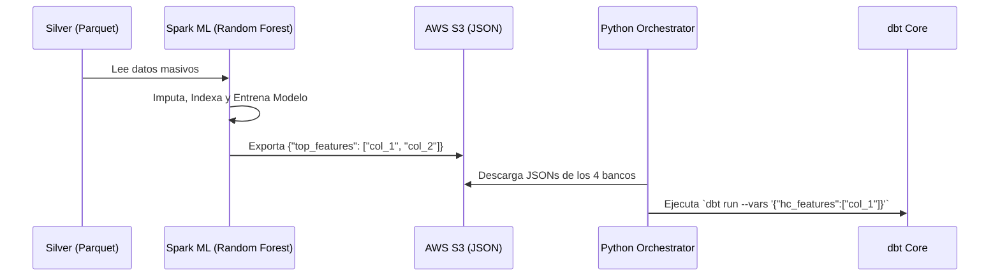
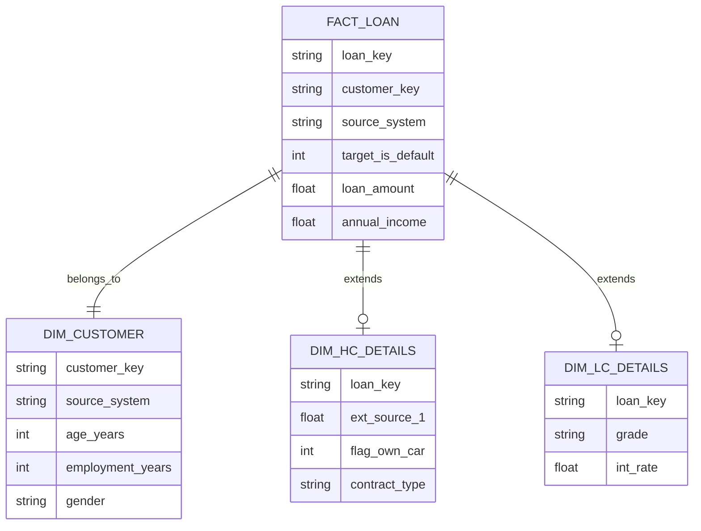

# Arquitectura del Pipeline de Datos: De Bronze a Snowflake (Caso 5)

Este documento detalla el flujo de datos completo, las transformaciones ejecutadas, las decisiones de limpieza y la arquitectura final implementada en el ecosistema AWS (S3, Glue, Athena) orquestado mediante Apache Airflow y dbt.

---

## 1. Visión General del DAG (Airflow)

El pipeline automatizado se orquesta en un DAG principal llamado `caso5_dbt_spark_ml_pipeline`. Este DAG gestiona la transición de los datos a través del paradigma Medallion (Bronze $\rightarrow$ Silver $\rightarrow$ Gold/Diamond), pero agregando una inyección de Machine Learning intermedia para habilitar "Data-Driven Modeling".

* [ ] 
  ```mermaid
  graph TD
      subgraph DataLake[S3 Data Lake]
          B[Bronze: Crudos]
          S[Silver: Limpios]
          G[Gold: BI Snowflake]
          D[Diamond: ML Store]
      end

      B -->|PySpark Job| S
      S -->|dbt Intermediate| S
      S -->|PySpark ML Job| JSON[Top Features JSON S3]
      JSON -->|Python Orchestrator| dbt_run[dbt run con variables]
      dbt_run -->|Genera| G
      dbt_run -->|Genera| D
  ```

---

## 2. Ingestión y Limpieza (Bronze $\rightarrow$ Silver)

La primera etapa involucra scripts de **PySpark** que leen 4 grandes datasets (CSV) directamente desde el bucket Bronze en AWS S3:

1. **Home Credit Default Risk**
2. **Lending Club**
3. **Give Me Some Credit**
4. **Loan Prediction**

### ¿Qué ocurre con los CSV?

El script genérico `bronze_to_silver_transform.py` procesa la data masivamente aplicando las siguientes reglas de gobierno:

- **Descarte de Duplicados:** Se eliminan todas las filas 100% repetidas (`df.dropDuplicates()`).
- **Descarte por Calidad (>80% Nulos):** Cualquier columna que tenga más del 80% de sus valores nulos es descartada automáticamente. Spark escanea el DataFrame entero, calcula la proporción de nulos, y extrae un arreglo de columnas a eliminar.
- **Normalización de Nombres:** Se pasan a minúsculas, se quitan espacios y símbolos raros, reemplazándolos con guiones bajos (`_`).
- **Homologación del Target:** Mapeamos variables distintas (`loan_status`, `seriousdlqin2yrs`, `target`) a una única columna binaria estándar global llamada **`is_default`**.
- **Transformaciones de Negocio:** Convierte todas las columnas que empiezan con `days_` (e.g., `days_birth`) a `years_` dividiendo entre 365.25.
- **Salida:** Se sobreescribe (Overwrite) la capa Silver en formato Parquet (altamente comprimido).

---

## 3. Inteligencia Artificial como Filtro (PySpark ML)

En lugar de que un humano adivine qué columnas sirven, introdujimos un script de PySpark ML (`feature_discovery.py`) que:

1. **Filtra Nulos Totales:** Si la capa Silver soltó alguna columna con 100% de nulos (lo cual hace colapsar a los imputadores), Spark ML la detecta y la ignora.
2. **Imputación:** Rellena numéricos faltantes con la *Mediana* y categóricos con la *Moda*.
3. **Indexación y Ensamblaje:** Convierte strings a números usando `StringIndexer` y consolida todas las características en un `VectorAssembler`.
4. **Random Forest Classifier:** Entrena un modelo predictivo rápido para estimar la probabilidad de `is_default`.
5. **Feature Importance:** Extrae los pesos de las variables, ordena las más importantes y guarda el **TOP 20** en un archivo JSON plano en S3.



---

## 4. El Modelo Híbrido Final (Gold & Diamond)

Una vez que dbt recibe la lista de las mejores variables desde Machine Learning a través del script inyector (`run_dbt_with_ml_vars.py`), se encarga de crear dos ecosistemas separados dentro de Athena:

### 💎 La Capa Diamond (Machine Learning Feature Store)

Creada mediante bucles *Jinja*. Iteran dinámicamente sobre la lista JSON de variables dictadas por la IA.

- **Resultado:** Tablas planas ultraligeras (`diamond_hc_features`, `diamond_lc_features`, etc.) que contienen estrictamente la llave de identificación (`id`), el target (`is_default`) y las top variables seleccionadas.
- **Propósito:** Listas para que un MLOps Engineer entrene el modelo definitivo sin ruido.

### 🥇 La Capa Gold (Business Intelligence Snowflake Schema)

Diseñada exclusivamente para herramientas de visualización como PowerBI o Tableau, garantizando rendimiento y riqueza de datos.



#### Reglas del Copo de Nieve (Snowflake) implementado:

1. **`fact_loan`**: Tabla transaccional central con métricas universales consolidadas y parseadas mediante protección extrema `try_cast()`.
2. **`dim_customer`**: Dimensión compartida de atributos demográficos que aplican a todos los seres humanos en los distintos bancos.
3. **Tablas Satélite (`dim_hc_details`, `dim_gmsc_details`...)**: Tablas anexas de uniones condicionales que **preservan todas las columnas únicas de cada banco**. Así el analista de BI no pierde información del negocio intentando forzar todo en una misma tabla gigante y llena de nulos.
