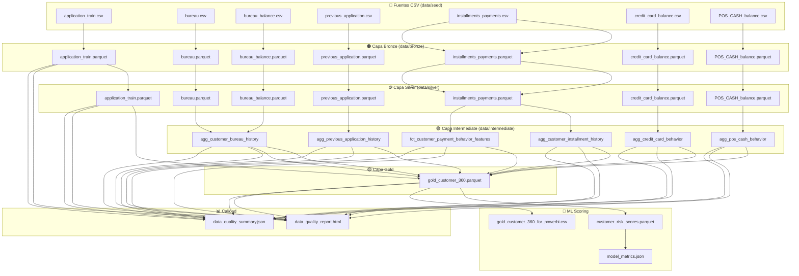

# Documento de Linaje de Datos — Plataforma de Riesgo Financiero (Caso 5)

**Versión:** 1.0
**Fecha:** 2025-01
**Autor:** Equipo de Gobernanza de Datos
**Alcance:** Home Credit Default Risk Dataset — Plataforma de Riesgo Crediticio para Entidad de Préstamos Digitales en América Latina

---

## 1. Introducción

El linaje de datos es un componente fundamental de la gobernanza de datos de la Plataforma de Riesgo Financiero. Este documento traza el origen, las transformaciones y el destino de cada dato a lo largo de las cinco capas del data lakehouse: **Bronze**, **Silver**, **Intermediate**, **Gold** y **ML Scoring**. Su propósito es garantizar la trazabilidad completa desde los archivos CSV fuente hasta las predicciones de riesgo crediticio, permitiendo a los equipos de auditoría, cumplimiento regulatorio y operaciones entender exactamente cómo se construye cada métrica, agregación y score de riesgo.

La plataforma procesa 7 conjuntos de datos originales del dataset *Home Credit Default Risk* de Kaggle, que contienen información de solicitudes de crédito, historial en burós de crédito, pagos de cuotas, balances de tarjetas de crédito y registros de POS CASH. A partir de estos datos se genera una vista unificada del cliente (Customer 360) que alimenta modelos de scoring basados en Regresión Logística y Random Forest.

Este documento es obligatorio para cualquier cambio en la estructura de datos fuente, modificaciones a las reglas de transformación o actualizaciones en los modelos de machine learning, conforme a los estándares de gobernanza de la organización.

---

## 2. Mapeo Fuente-Destino por Dataset

### 2.1 application_train.csv → Bronze → Silver → Gold

| Capa | Tabla/Ruta | Clave Primaria | Descripción |
|------|-----------|----------------|-------------|
| **Fuente** | `data/seed/application_train.csv` | — | Archivo CSV original descargado de Kaggle con 307,511 solicitudes de crédito y 122 columnas. |
| **Bronze** | `data/bronze/application_train/application_train.parquet` | SK_ID_CURR | Ingesta directa CSV→Parquet con columnas técnicas: `_ingestion_date`, `_source_file`, `_dataset_name`, `_row_hash`. Sin transformaciones de datos. |
| **Silver** | `data/silver/application_train/application_train.parquet` | SK_ID_CURR | Tipado explícito (Int64, float64, string). Corrección de anomalías (DAYS_EMPLOYED=365243→null). Imputación de NAME_TYPE_SUITE→"Unaccompanied", OCCUPATION_TYPE→"Unknown". Deduplicación por SK_ID_CURR. Columnas normalizadas (AVG/MEDI/MODE) casteadas a float64. |
| **Gold** | `data/gold/gold_customer_360/gold_customer_360.parquet` | SK_ID_CURR | Tabla base del Customer 360. Se seleccionan 23 columnas clave del perfil del cliente. Se añaden columnas calculadas: `age_years`, `credit_to_income_ratio`, `annuity_to_income_ratio`, `risk_segment`. Se hace LEFT JOIN con las 6 tablas Intermediate. |

### 2.2 bureau.csv → Bronze → Silver → Intermediate (agg_customer_bureau_history) → Gold

| Capa | Tabla/Ruta | Clave Primaria | Descripción |
|------|-----------|----------------|-------------|
| **Fuente** | `data/seed/bureau.csv` | — | Historial de créditos previos reportados al buró. ~1.7M registros con claves SK_ID_CURR y SK_ID_BUREAU. |
| **Bronze** | `data/bronze/bureau/bureau.parquet` | SK_ID_BUREAU | Ingesta CSV→Parquet con columnas técnicas de auditoría. |
| **Silver** | `data/silver/bureau/bureau.parquet` | SK_ID_BUREAU | Tipado explícito: SK_ID_CURR/SK_ID_BUREAU→Int64, campos categóricos (CREDIT_ACTIVE, CREDIT_CURRENCY, CREDIT_TYPE)→string, campos numéricos (DAYS_CREDIT, AMT_CREDIT_SUM, etc.)→float64. Deduplicación por SK_ID_BUREAU. |
| **Intermediate** | `data/intermediate/agg_customer_bureau_history/agg_customer_bureau_history.parquet` | SK_ID_CURR | Agregación por cliente: `total_credits`, `active_credits`, `closed_credits`, `total_overdue_debt`, `max_overdue_days`, `avg_credit_amount`. Se agrupa por SK_ID_CURR a partir de Silver bureau + Silver bureau_balance. |
| **Gold** | `data/gold/gold_customer_360/gold_customer_360.parquet` | SK_ID_CURR | LEFT JOIN con sufijo `_bureau`. Todas las columnas de agg_customer_bureau_history se incorporan con sufijo. |

### 2.3 bureau_balance.csv → Bronze → Silver → Intermediate (agg_customer_bureau_history) → Gold

| Capa | Tabla/Ruta | Clave Primaria | Descripción |
|------|-----------|----------------|-------------|
| **Fuente** | `data/seed/bureau_balance.csv` | — | Balances mensuales de créditos del buró. ~27.3M registros con clave compuesta SK_ID_BUREAU + MONTHS_BALANCE. |
| **Bronze** | `data/bronze/bureau_balance/bureau_balance.parquet` | SK_ID_BUREAU + MONTHS_BALANCE | Ingesta CSV→Parquet con columnas técnicas. |
| **Silver** | `data/silver/bureau_balance/bureau_balance.parquet` | SK_ID_BUREAU + MONTHS_BALANCE | Tipado: SK_ID_BUREAU/MONTHS_BALANCE→Int64, STATUS→string. Deduplicación por clave compuesta. |
| **Intermediate** | `data/intermediate/agg_customer_bureau_history/agg_customer_bureau_history.parquet` | SK_ID_CURR | Se combina con bureau.csv a través de SK_ID_BUREAU para enriquecer las métricas de historial crediticio por cliente (conteo de créditos activos/cerrados, deuda vencida, etc.). No genera tabla Intermediate propia; alimenta agg_customer_bureau_history. |
| **Gold** | `data/gold/gold_customer_360/gold_customer_360.parquet` | SK_ID_CURR | Contribuye indirectamente a través de agg_customer_bureau_history. |

### 2.4 previous_application.csv → Bronze → Silver → Intermediate (agg_previous_application_history) → Gold

| Capa | Tabla/Ruta | Clave Primaria | Descripción |
|------|-----------|----------------|-------------|
| **Fuente** | `data/seed/previous_application.csv` | — | Historial de solicitudes previas de crédito. ~1.7M registros con claves SK_ID_PREV y SK_ID_CURR. |
| **Bronze** | `data/bronze/previous_application/previous_application.parquet` | SK_ID_PREV | Ingesta CSV→Parquet con columnas técnicas. |
| **Silver** | `data/silver/previous_application/previous_application.parquet` | SK_ID_PREV | Tipado: enteros (SK_ID_PREV, SK_ID_CURR, NFLAG_*), strings (NAME_CONTRACT_TYPE, NAME_CONTRACT_STATUS, CHANNEL_TYPE, etc.), floats (AMT_*, RATE_*, DAYS_DECISION, CNT_PAYMENT). Deduplicación por SK_ID_PREV. |
| **Intermediate** | `data/intermediate/agg_previous_application_history/agg_previous_application_history.parquet` | SK_ID_CURR | Agregación por cliente: `total_previous_apps`, `approval_rate`, `avg_applied_amount`, `avg_rejected_amount`. Se agrupa por SK_ID_CURR. |
| **Gold** | `data/gold/gold_customer_360/gold_customer_360.parquet` | SK_ID_CURR | LEFT JOIN con sufijo `_prevapp`. |

### 2.5 installments_payments.csv → Bronze → Silver → Intermediate → Gold

| Capa | Tabla/Ruta | Clave Primaria | Descripción |
|------|-----------|----------------|-------------|
| **Fuente** | `data/seed/installments_payments.csv` | — | Historial de pagos de cuotas. ~13.6M registros con claves SK_ID_PREV, SK_ID_CURR, NUM_INSTALMENT_NUMBER. |
| **Bronze** | `data/bronze/installments_payments/installments_payments.parquet` | SK_ID_PREV + NUM_INSTALMENT_NUMBER | Ingesta CSV→Parquet con columnas técnicas. |
| **Silver** | `data/silver/installments_payments/installments_payments.parquet` | SK_ID_PREV + NUM_INSTALMENT_NUMBER | Tipado: enteros (SK_ID_PREV, SK_ID_CURR, NUM_INSTALMENT_NUMBER, NUM_INSTALMENT_VERSION), floats (DAYS_INSTALMENT, DAYS_ENTRY_PAYMENT, AMT_INSTALMENT, AMT_PAYMENT). Deduplicación por clave compuesta. |
| **Intermediate** | `data/intermediate/agg_customer_installment_history/agg_customer_installment_history.parquet` | SK_ID_CURR | Agregación básica: `total_installments`, `total_amount_paid`, `avg_installment_amount`, `avg_days_installment_difference`. |
| **Intermediate** | `data/intermediate/fct_customer_payment_behavior_features/fct_customer_payment_behavior_features.parquet` | SK_ID_CURR | Features temporales avanzados: `avg_payment_delay`, `max_days_overdue`, `count_late_payments`, `avg_payment_delay_3m`, `avg_payment_delay_6m`, `avg_payment_delay_12m`, `missed_payment_count_90d`, `payment_consistency_score`, `total_unpaid_amount`. |
| **Gold** | `data/gold/gold_customer_360/gold_customer_360.parquet` | SK_ID_CURR | LEFT JOIN de ambas tablas Intermediate con sufijos `_install` y `_behavior`. |

### 2.6 credit_card_balance.csv → Bronze → Silver → Intermediate (agg_credit_card_behavior) → Gold

| Capa | Tabla/Ruta | Clave Primaria | Descripción |
|------|-----------|----------------|-------------|
| **Fuente** | `data/seed/credit_card_balance.csv` | — | Balances mensuales de tarjetas de crédito. ~3.8M registros con clave compuesta SK_ID_PREV + MONTHS_BALANCE. |
| **Bronze** | `data/bronze/credit_card_balance/credit_card_balance.parquet` | SK_ID_PREV + MONTHS_BALANCE | Ingesta CSV→Parquet con columnas técnicas. |
| **Silver** | `data/silver/credit_card_balance/credit_card_balance.parquet` | SK_ID_PREV + MONTHS_BALANCE | Tipado: enteros (SK_ID_PREV, SK_ID_CURR, MONTHS_BALANCE, CNT_DRAWINGS_*, SK_DPD, SK_DPD_DEF), floats (AMT_DRAWINGS_*, AMT_PAYMENT_*, AMT_RECEIVABLE_*). Deduplicación por clave compuesta. |
| **Intermediate** | `data/intermediate/agg_credit_card_behavior/agg_credit_card_behavior.parquet` | SK_ID_CURR | Agregación: `avg_balance`, `max_dpd`, `total_drawings`, `total_payments`. |
| **Gold** | `data/gold/gold_customer_360/gold_customer_360.parquet` | SK_ID_CURR | LEFT JOIN con sufijo `_cc`. |

### 2.7 POS_CASH_balance.csv → Bronze → Silver → Intermediate (agg_pos_cash_behavior) → Gold

| Capa | Tabla/Ruta | Clave Primaria | Descripción |
|------|-----------|----------------|-------------|
| **Fuente** | `data/seed/POS_CASH_balance.csv` | — | Balances mensuales de préstamos POS CASH. ~10M registros con clave compuesta SK_ID_PREV + MONTHS_BALANCE. |
| **Bronze** | `data/bronze/POS_CASH_balance/POS_CASH_balance.parquet` | SK_ID_PREV + MONTHS_BALANCE | Ingesta CSV→Parquet con columnas técnicas. |
| **Silver** | `data/silver/POS_CASH_balance/POS_CASH_balance.parquet` | SK_ID_PREV + MONTHS_BALANCE | Tipado: enteros (SK_ID_PREV, SK_ID_CURR, MONTHS_BALANCE, CNT_INSTALMENT, CNT_INSTALMENT_FUTURE, SK_DPD, SK_DPD_DEF), strings (NAME_CONTRACT_STATUS). Deduplicación por clave compuesta. |
| **Intermediate** | `data/intermediate/agg_pos_cash_behavior/agg_pos_cash_behavior.parquet` | SK_ID_CURR | Agregación: `totalcontracts`, `completed_contracts`, `avg_cnt_installment`, `avg_sk_dpd`. |
| **Gold** | `data/gold/gold_customer_360/gold_customer_360.parquet` | SK_ID_CURR | LEFT JOIN con sufijo `_pos`. |

---

## 3. Transformaciones a Nivel de Columna

Las siguientes columnas experimentan transformaciones explícitas durante el paso de Bronze a Silver:

| Columna | Dataset Origen | Transformación | Justificación |
|---------|---------------|----------------|---------------|
| `DAYS_EMPLOYED` | application_train | Valor `365243` (≈1000 años) reemplazado por `None` (nulo) | Valor centinela que representa empleo no informado; distorsiona métricas si se trata como valor real. |
| `NAME_TYPE_SUITE` | application_train | Valores nulos → `"Unaccompanied"` | Valor por defecto para la categoría más frecuente; evita pérdida de registros. |
| `OCCUPATION_TYPE` | application_train | Valores nulos → `"Unknown"` | Preserva registros sin ocupación conocida como categoría explícita. |
| `NAME_FAMILY_STATUS` | application_train | Valores nulos → `"Unknown"` | Categoría de respaldo para estado civil no informado. |
| `FLAG_OWN_CAR` | application_train | `string` → `Int64` (Y=1, N=0) | Normalización de flags categóricos a enteros para modelos ML. |
| `FLAG_OWN_REALTY` | application_train | `string` → `Int64` (Y=1, N=0) | Normalización de flags categóricos a enteros para modelos ML. |
| `DAYS_BIRTH` | application_train | `float64` → `Int64` | Edad debe ser un número entero de días. |
| Columnas `*_AVG`, `*_MEDI`, `*_MODE` | application_train | Detección dinámica → `float64` | ~50 columnas de datos normalizados de edificios; tipado consistente. |
| Todas las columnas numéricas | Todos los datasets | `pd.to_numeric(errors="coerce")` | Conversión segura que convierte valores no numéricos a NaN. |

---

## 4. Rutas de Unión (Join Paths)

La columna `SK_ID_CURR` es la **clave primaria universal** que conecta todas las capas hacia la vista Gold Customer 360. El flujo de joins es el siguiente:

```
gold_customer_360 (base: Silver application_train por SK_ID_CURR)
  ├── LEFT JOIN ← agg_customer_installment_history (por SK_ID_CURR)
  ├── LEFT JOIN ← fct_customer_payment_behavior_features (por SK_ID_CURR)
  ├── LEFT JOIN ← agg_customer_bureau_history (por SK_ID_CURR)
  ├── LEFT JOIN ← agg_previous_application_history (por SK_ID_CURR)
  ├── LEFT JOIN ← agg_credit_card_behavior (por SK_ID_CURR)
  └── LEFT JOIN ← agg_pos_cash_behavior (por SK_ID_CURR)
```

**Claves secundarias utilizadas en capas intermedias:**

| Clave | Uso |
|-------|-----|
| `SK_ID_BUREAU` | Une bureau.csv con bureau_balance.csv para calcular métricas de historial crediticio antes de agrupar por SK_ID_CURR. |
| `SK_ID_PREV` | Identifica aplicaciones y contratos previos. Se utiliza como parte de la clave compuesta en installments_payments, credit_card_balance y POS_CASH_balance. |
| `SK_ID_CURR + NUM_INSTALMENT_NUMBER` | Clave compuesta de deduplicación en installments_payments. |
| `SK_ID_PREV + MONTHS_BALANCE` | Clave compuesta de deduplicación en credit_card_balance y POS_CASH_balance. |

Todos los merges en Gold son **LEFT JOIN**, lo que garantiza que ningún cliente de la tabla base se pierda, incluso si no tiene registros en las tablas complementarias. Los valores nulos resultante se reemplazan por 0 (numéricos) o "Unknown" (categóricos).

---

## 5. Diagrama de Flujo de Datos (Mermaid)



---

## 6. Análisis de Impacto

La siguiente tabla describe el impacto downstream si una tabla fuente es modificada, eliminada o contiene errores:

| Tabla Fuente Modificada | Bronze Afectado | Silver Afectado | Intermediate Afectado | Gold Afectado | ML Scoring Afectado | Quality Report Afectado |
|------------------------|:---------------:|:---------------:|:--------------------:|:-------------:|:-------------------:|:----------------------:|
| `application_train.csv` | ✅ | ✅ | — | ✅ (tabla base) | ✅ (TARGET, features demográficas) | ✅ |
| `bureau.csv` | ✅ | ✅ | ✅ agg_customer_bureau_history | ✅ | ✅ (total_credits, active_credits, etc.) | ✅ |
| `bureau_balance.csv` | ✅ | ✅ | ✅ agg_customer_bureau_history | ✅ | ✅ (métodos de bureau_balance alimentan agregaciones) | ✅ |
| `previous_application.csv` | ✅ | ✅ | ✅ agg_previous_application_history | ✅ | ✅ (approval_rate, total_previous_apps) | ✅ |
| `installments_payments.csv` | ✅ | ✅ | ✅ agg_customer_installment_history, fct_customer_payment_behavior_features | ✅ | ✅ (payment_consistency_score, max_days_overdue, etc.) | ✅ |
| `credit_card_balance.csv` | ✅ | ✅ | ✅ agg_credit_card_behavior | ✅ | ✅ (avg_balance, max_dpd) | ✅ |
| `POS_CASH_balance.csv` | ✅ | ✅ | ✅ agg_pos_cash_behavior | ✅ | ✅ (totalcontracts, avg_sk_dpd) | ✅ |

### 6.1 Impacto Crítico

- **application_train.csv** es la tabla más crítica: es la base de la vista Gold y contiene la variable objetivo `TARGET` para el modelo ML. Cualquier cambio en esta tabla impacta **todas las capas downstream** y requiere re-ejecución completa del pipeline.
- **installments_payments.csv** alimenta **dos tablas Intermediate** (agg_customer_installment_history y fct_customer_payment_behavior_features), por lo que sus features de comportamiento de pago tienen doble dependencia.

### 6.2 Estrategia de Re-procesamiento

Ante un cambio en una tabla fuente, el orden de re-procesamiento debe ser:

1. **Bronze**: Re-ingestar el dataset afectado (reemplaza el Parquet existente).
2. **Silver**: Re-transformar el dataset afectado.
3. **Intermediate**: Re-ejecutar las agregaciones que dependen del dataset Silver modificado.
4. **Gold**: Reconstruir la vista gold_customer_360 completa (requiere todas las tablas Intermediate).
5. **ML Scoring**: Re-entrenar modelos y regenerar predicciones.
6. **Quality**: Regenerar reporte de calidad completo.

---

## 7. Columnas Técnicas de Auditoría

Todas las tablas Bronze incluyen las siguientes columnas técnicas que no existen en las fuentes originales:

| Columna | Tipo | Descripción |
|---------|------|-------------|
| `_ingestion_date` | string (ISO 8601) | Marca temporal UTC de la ingesta. |
| `_source_file` | string | Nombre del archivo CSV de origen. |
| `_dataset_name` | string | Nombre lógico del dataset. |
| `_row_hash` | string (MD5, 32 caracteres) | Hash de la fila calculado sobre columnas originales ordenadas alfabéticamente. Permite detección de duplicados y cambios en datos fuente. |

La tabla Gold añade `updated_at` (timestamp ISO 8601 de la última construcción).

---

## 8. Control de Versiones y Trazabilidad

- Cada ejecución del pipeline genera un nuevo `updated_at` en la tabla Gold.
- Los archivos Parquet se sobrescriben (no se versionan por timestamp). Para trazabilidad histórica, se recomienda implementar un mecanismo de snapshot o archivado en futuras iteraciones.
- El reporte de calidad (`data_quality_report.html` y `data_quality_summary.json`) incluye `generated_at` como marca temporal.

---

*Documento mantenido por el equipo de Gobernanza de Datos. Cualquier modificación al pipeline ETL debe actualizar este documento antes de pasar a producción.*
