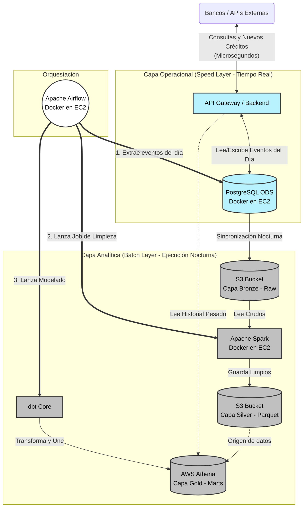
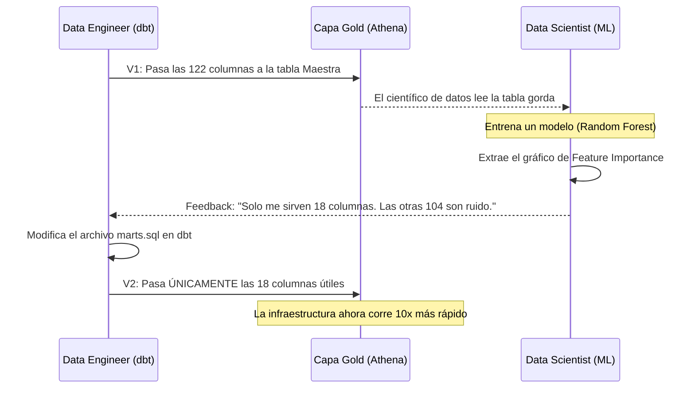

# BLUEPRINT DE ARQUITECTURA: BURÓ DE CRÉDITO CENTRAL (CASO 5)

Este documento sirve como la guía maestra y arquitectónica para el despliegue del proyecto en el clúster de AWS. Refina las propuestas iniciales integrando una **Arquitectura Lambda Híbrida** para manejar los 4 datasets masivos de Kaggle y permitir operaciones en tiempo real.

---

## 1. Visión General y Objetivo de Negocio

El objetivo es construir un **Data Warehouse Centralizado** que actúe como un Buró de Crédito. Recibirá información heterogénea de 4 entidades distintas (Home Credit, Lending Club, Give Me Some Credit, Loan Prediction). 

La arquitectura resolverá los siguientes problemas operacionales:
1.  **Volumen Masivo:** Ingesta de archivos de hasta 1.6 GB.
2.  **Heterogeneidad:** Distintos formatos y calidades de datos.
3.  **Latencia Cero (Intra-día):** Necesidad de los bancos de consultar y actualizar eventos de crédito en tiempo real.
4.  **Carga Analítica (Histórica):** Procesamiento pesado nocturno para calcular modelos de riesgo sin afectar el servidor operacional.

---

## 2. Diagrama de Arquitectura Global (Lambda Architecture)

Para lograr el procesamiento histórico sin perder el tiempo real, implementamos una división entre la **Capa Batch** (Pesada) y la **Capa Speed/ODS** (Rápida).

---

## 3. Topología de Infraestructura (AWS & Docker)

Siguiendo la premisa de "menos servicios administrados es mejor" para tener mayor control:

*   **Instancias EC2:** Todos los servicios activos (Airflow, Spark, dbt, API, Postgres) estarán dockerizados y desplegados sobre instancias EC2.
*   **Gestión de Permisos (Roles IAM):** En lugar de gestionar credenciales dentro de los contenedores, las instancias EC2 tendrán asignado un **IAM Instance Profile**. Este perfil les otorgará permisos transparentes y seguros para interactuar con AWS S3 y AWS Athena.
*   **Almacenamiento (S3):** El único servicio 100% administrado será S3, que servirá como nuestro Data Lake inmutable para las capas Bronze y Silver.
*   **Motor de Consultas (Athena):** Servicio Serverless usado exclusivamente por dbt para construir la capa Gold sin requerir bases de datos gigantes en nuestras EC2.

---

## 4. El Flujo de Datos (Data Pipeline)

El ciclo de vida del dato sigue un enfoque de **ELT** (Extract, Load, Transform) modificado para Big Data.

### Paso 1: Ingesta (Fuentes -> Bronze)
*   **Cuándo ocurre:** Diariamente.
*   **Qué hace Airflow:** Ejecuta tareas que descargan la información de los bancos (en nuestro caso, los CSV de Kaggle iniciales) y extrae los registros insertados ese día en el ODS (Postgres).
*   **Destino:** `s3://mi-bucket/bronze/`. Todo se guarda crudo, sin tocar ni una coma.

### Paso 2: Limpieza Técnica (Bronze -> Silver)
*   **Herramienta:** Apache Spark.
*   **Objetivo:** Spark lee los gigabytes de CSVs crudos. Su trabajo es 100% estructural:
    *   Casteo masivo de tipos (String a Integer/Date).
    *   Detección de esquemas rotos.
    *   Compresión y particionado.
*   **Destino:** `s3://mi-bucket/silver/`. Los archivos se guardan en formato **Apache Parquet**. Esto reduce el tamaño de Lending Club de 1.6 GB a unos ~300 MB y acelera las consultas 100x.

### Paso 3: Lógica de Negocio (Silver -> Gold)
*   **Herramienta:** dbt + AWS Athena.
*   **Objetivo:** dbt crea modelos (archivos `.sql`) que le dicen a Athena cómo transformar los datos de Silver en métricas de negocio.
    *   *Staging:* Renombra columnas para que los 4 bancos hablen el mismo idioma (Ej. `DebtRatio` vs `Debt-To-Income`).
    *   *Marts:* Crea tablas maestras uniendo (UNION ALL) a todos los clientes. Aquí se truncan anomalías (como Edades de 0 años o Ratios astronómicos detectados en el EDA).

---

## 5. El Ciclo de Vida del Feature Selection (MLOps)

Dado que tenemos datasets con más de 120 columnas (Home Credit), no podemos adivinar en dbt cuáles son las útiles. Implementaremos un ciclo interactivo:

**Manejo del Data Leakage (Fuga de Datos):** 
Tal como descubrimos en el EDA de *Lending Club*, el Data Engineer deberá instruir a dbt desde el día 1 para que **elimine todas las columnas de comportamiento post-crédito** en las tablas de entrenamiento, garantizando que el modelo predictivo evalúe a los clientes de forma justa.

---

## 6. Siguientes Pasos para el Despliegue (Roadmap)

Para comenzar a construir esto en tu repositorio de DAGs de AWS, sigue este orden:

1.  **Infra AWS:** 
    *   Crear los buckets de S3 (`bronze/`, `silver/`).
    *   Asignar el rol IAM a tus instancias EC2.
2.  **ODS:** Levantar el contenedor de PostgreSQL en tu EC2 y crear las tablas base vacías.
3.  **Scripts de Spark:** Crear los scripts `.py` que lean de Bronze y escriban Parquet en Silver.
4.  **Airflow DAG:** Escribir el `credit_bureau_daily_etl.py` usando `BashOperator` (o DockerOperator) para disparar Spark, y luego usar `BashOperator` para ejecutar comandos nativos de `dbt run` apuntando a Athena.
